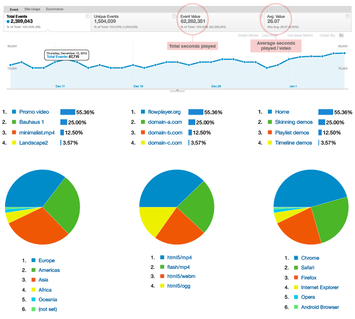

# Google Analytics

* * *

## totals
How much video is watched? How many minutes?



## bars
What are the most popular videos? How much in foreign sites? What about the home page?

## pies

Which continent? Which video format? Which browser?

# How it works?

Flowplayer tracks following information when user **leaves a page**:

1.  Seconds played. If video was repeated this is more than the duration of the video
2.  Flash or HTML5 / video format
3.  Video [title](/docs/setup.html#clip-options) or file name

These views can be found under

_[Google Analytics](http://google.com/analytics) > Content > Events > Top Events > Video / Seconds played_.

Play around with the 'Secondary dimension' dropdown. For a better visual view select the pie chart. If your site already uses or is planning to use Google Analytics it's good to view those statistics in the same place.

## Setting up

Set up Analytics by [configuring](setup.html#configuration) your Google Analytics ID. For example:

```html
<div class="flowplayer" data-analytics="UA-27182341-1" title="Video title">
   <video>
      <source type="video/webm" src="/my/video.webm">
      <source type="video/mp4"  src="/my/video.mp4">
   </video>
</div>
```

This site uses a global configuration to set up analytics for [all players on the page](setup.html#global-configuration):

```
flowplayer.conf.analytics = "UA-27182341-1";
```

The title for Analytics is taken from the clip's [title](/docs/setup.html#clip-options) or, if not set, the video's file name.

If the player is [shared](sharing.html) on a foreign site the analytics ID is carried along so you can view how much video is played on these external domains.

## Configuration

The Analytics extension provides one [player option](setup.html#extension-and-plugin-options):

<table class="listing list" id="player_conf">

<tbody>

<tr class="r1">

<td class="c1">option</td>

<td class="c2">description</td>

</tr>

<tr class="r2">

<td class="c1">analytics</td>

<td class="c2">The site's Google Analytics ID.</td>

</tr>

</tbody>

</table>

## What is tracked?

The best place to track video data is when user leaves the page. You know exactly the total amount of seconds viewed. Sending data during playback gives you messy results; pausing, fullscreen, seeking are not important.

Flowplayer tracks the following events:

*   `load` [player event](/docs/api.html#events)
*   `unload` [player event](/docs/api.html#events)
*   `unload` [window event](https://developer.mozilla.org/en-US/docs/Web/API/WindowEventHandlers/onunload)

Addtionally a [heartbeat](https://developers.google.com/analytics/devguides/collection/gajs/eventTrackerGuide#non-interaction) is sent at an interval of 10 minutes to prevent tracking timeouts.

If you do wish to implement a more fine-grained player event tracking you can use the various [player events](/docs/api.html#events) to communicate with the [Google Analytics API](https://developers.google.com/analytics/devguides/collection/gajs/eventTrackerGuide).