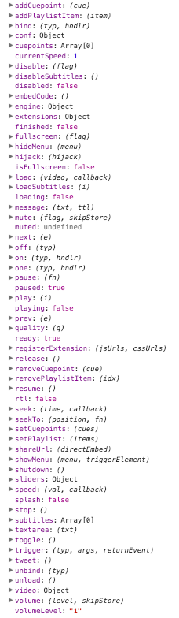

*   [JavaScript API](#javascript-api)
*   + [Global API access](#global-api-access)
    *   [Console screenshot](#console-screenshot)
*   [Selective API access](#selective-api-access)
*   [Instant API access](#instant-api-access)
*   + [Properties](#properties)
    *   [Extension and plugin properties](#extension-and-plugin-properties)
*   + [Video object](#video-object)
    *   [Extension and plugin video properties](#extension-and-plugin-video-properties)
*   + [Methods](#methods)
    *   [Extension methods](#extension-methods)
*   + [Load method](#load-method)
    *   [Load player](#load-player)
    *   [Load video](#load-video)
*   + [Events](#events)
    *   [Error codes](#error-codes)
    *   [Extension events](#extension-events)
*   + [Attaching events](#attaching-events)
    *   [API event binding](#api-event-binding)
    *   [jQuery event binding](#jquery-event-binding)
    *   [Name space](#name-space)
    *   [Attaching to JavaScript installation](#attaching-to-javascript-installation)
    *   [Attaching to manual installation](#attaching-to-manual-installation)
    *   [Event chaining](#event-chaining)
    *   [Event prevention](#event-prevention)
*   [Engines](#engines)
*   [window.flowplayer](#windowflowplayer)
*   [flowplayer.set](#flowplayerset)
*   [flowplayer.support](#flowplayersupport)
*   [Migration from Version 5](#migration-from-version-5)


# JavaScript API

*   **Note** Sections exclusively dedicated to [VIDEO tag based installations](/docs/setup.html#videotag-install) are flagged with a pink **border**, sections exclusively dedicated to [pure JavaScript installations](/docs/setup.html#javascript-install) with a **green border**.  
    Advanced opions and functions are colored **red**.

# Global API access

Use the `flowplayer` function to get a global handle on the API. Here we attach two custom [events](/docs/api.html#events) to the API of all players which will be installed on the page:

```js
flowplayer(function (api, root) {
 
  api.on("load", function () {
 
    // do something when a new video is about to be loaded
 
  }).on("ready", function () {
 
    // do something when a video is loaded and ready to play
 
  });
 
});
```

View [standalone demo](/standalone/api/access.html).

This anonymous callback function is provided by the Flowplayer library and is called every time a Flowplayer instance is created. Think of it as a "mini-plugin".

You use it to customize the default **behaviour** of all players on your page in a similar manner as you set [global configuration](/docs/setup.html#global-configuration) options, and thus it should be called right after the flowplayer script is included in the [HEAD section](setup.html#prerequisites) of the page and _before_ the page is loaded - before the [DOM](http://www.w3schools.com/js/js_htmldom.asp) (Document Object Model) is ready.

The API is provided by the first argument and it looks like this in the browser console:


## Console screenshot

Via the second argument - called `root` above - you can access the root or container element of the player.

*   **tip** The global `flowplayer` function is the only place to catch the initial `load` [event](#events) in non [splash](setup.html#splash) setups.

# Selective API access

Once the players are installed initialized you can access specific player instances like this:

```js
// get the first player
var api = flowplayer();
 
// same thing with jQuery
api = $(".flowplayer:first").data("flowplayer");
 
// and the second player
api = flowplayer(1);
 
// .. with jQuery
api = $(".flowplayer:eq(1)").data("flowplayer");
 
// use any jQuery selector
api = $(".mycustom.flowplayer").data("flowplayer");
 
// return the API in given jQuery object
api = flowplayer($(".myplayer"));
 
// or DOM object
var elem = document.getElementById("myplayer");
api = flowplayer(elem);
```

The [installation method](/docs/setup.html#3-ways-to-install) determines when you have access to selected APIs:

*   [automatic](/docs/setup.html#automatic-install): when the [DOM](http://www.w3schools.com/js/js_htmldom.asp) is ready
*   [manual](/docs/setup.html#manual-install): after the specific instance has been initialized
*   [JavaScript](/docs/setup.html#javascript-install): after the specific instance has been initialized or [instant API access](/docs/api.html#instant-api-access)


# Instant API access

The [pure JavaScript installation](/docs/setup.html#javascript-install) allows instant API access to the specific instance:

```js
var api = flowplayer("#player", {
  // player configuration goes here
});
```

Contrary to the other [selective API access methods](/docs/api.html#selective-api-access) the API is accessible in a 1-step operation.


# Properties

During its life cycle the player is in varying states which are reflected in the the properties of the API. Here is a complete list of the API properties:

<table>

<tbody>

<tr class="r1">

<td class="c1">property</td>

<td class="c2">default value</td>

<td class="c3">description</td>

</tr>

<tr class="r2">

<td class="c1">conf</td>

<td class="c2">Object</td>

<td class="c3">the initial configuration object</td>

</tr>

<tr class="r3">

<td class="c1">currentSpeed</td>

<td class="c2">1</td>

<td class="c3">the current playback speed level:  
- 1 = normal speed  
less than 1 = slow motion  
greater than 1 = fast forward</td>

</tr>

<tr class="r4">

<td class="c1">disabled</td>

<td class="c2">false</td>

<td class="c3">true while the player is [disabled](#methods)</td>

</tr>

<tr class="r5">

<td class="c1">dvr</td>

<td class="c2">false</td>

<td class="c3">true while the current video is a [live DVR stream](setup.html#live-streaming)</td>

</tr>

<tr class="r6">

<td class="c1">engine</td>

<td class="c2">object</td>

<td class="c3">the chosen video engine, the name of the engine can be retrieved as `engine.engineName`</td>

</tr>

<tr class="r7">

<td class="c1">error</td>

<td class="c2">undefined</td>

<td class="c3">true once an error has occured</td>

</tr>

<tr class="r8">

<td class="c1">finished</td>

<td class="c2">false</td>

<td class="c3">true while the player is stopped at the end of the video</td>

</tr>

<tr class="r9">

<td class="c1">forcedSplash</td>

<td class="c2">false</td>

<td class="c3">whether a [splash](setup.html#splash) setup was enforced for this player, true on mobile devices</td>

</tr>

<tr class="r10">

<td class="c1">isFullscreen</td>

<td class="c2">false</td>

<td class="c3">true while the player is in fullscreen mode</td>

</tr>

<tr class="r11">

<td class="c1">live</td>

<td class="c2">false</td>

<td class="c3">true while the current video is a [live stream](setup.html#live-streaming), also live DVR</td>

</tr>

<tr class="r12">

<td class="c1">loading</td>

<td class="c2">false</td>

<td class="c3">true while the player is being loaded</td>

</tr>

<tr class="r13">

<td class="c1">muted</td>

<td class="c2">false</td>

<td class="c3">true while the player is muted</td>

</tr>

<tr class="r14">

<td class="c1">paused</td>

<td class="c2">false</td>

<td class="c3">true while the player is paused</td>

</tr>

<tr class="r15">

<td class="c1">playing</td>

<td class="c2">false</td>

<td class="c3">true while the player is playing</td>

</tr>

<tr class="r16">

<td class="c1">poster</td>

<td class="c2">false</td>

<td class="c3">true while the player is in [poster state](/docs/setup.html#poster)</td>

</tr>

<tr class="r17">

<td class="c1">ready</td>

<td class="c2">false</td>

<td class="c3">true once the player API is ready and completely loaded</td>

</tr>

<tr class="r18">

<td class="c1">rtl</td>

<td class="c2">false</td>

<td class="c3">true if the player has a [right-to-left](skinning.html#rtl) layout</td>

</tr>

<tr class="r19">

<td class="c1">seeking</td>

<td class="c2">false</td>

<td class="c3">true while the player is seeking</td>

</tr>

<tr class="r20">

<td class="c1">splash</td>

<td class="c2">false</td>

<td class="c3">true while the player is in [splash state](/docs/setup.html#splash)</td>

</tr>

<tr class="r21">

<td class="c1">video</td>

<td class="c2">Object</td>

<td class="c3">the current [video object](#video-object)</td>

</tr>

<tr class="r22">

<td class="c1">volumeLevel</td>

<td class="c2">0.8</td>

<td class="c3">the current volume level between 0 and 1</td>

</tr>

</tbody>

</table>

Depending on the state of the player at the moment when you grab the API or call one of its [methods](/docs/api.html#methods), the full depth of its properties might be not be available.

For example: Before the player is `ready` video [metadata](#video-object) such as its duration has not been processed and is therefore `undefined`. Similarly you cannot obtain a sensible value for the current playback position at all times. A safe way to retrieve that position would be:

```js
var api = flowplayer(), currentPos;
 
// get the current position, default to 0
currentPos = api.ready ? api.video.time : 0;

```

API properties should be considered as **read only**. Use API [methods](/docs/api.html#methods) to change the state of the player and its properties. **Setting** properties is only needed in advanced cases and situations which often should be avoided in the first place, like in [this demo](http://demos.flowplayer.org/scripting/recover.html) which recovers from an invalid video location.

*   <span class="label">Tip</span> When [skinning](skinning.html) is involved you can often achieve your scripting goals with pure [CSS programming](#css-programming-example) by defining rules for the [state classes](skinning.html#states) instead of querying JavaScript API properties.


## Extension and plugin properties

The following properties are provided by player extensions and plugins. Follow the link in the third column for further details:

<table>

<tbody>

<tr class="r1">

<td class="c1">property</td>

<td class="c2">kind</td>

<td class="c3">extension</td>

</tr>

<tr class="r2">

<td class="c1">cuepoints</td>

<td class="c2">array</td>

<td class="c3">[Cuepoints extension](cuepoints.html#properties)</td>

</tr>

<tr class="r3">

<td class="c1">embedCode</td>

<td class="c2">function</td>

<td class="c3">[Sharing extension](sharing.html#properties)</td>

</tr>

<tr class="r4">

<td class="c1">subtitles</td>

<td class="c2">array</td>

<td class="c3">[Subtitles extension](subtitles.html#properties)</td>

</tr>

</tbody>

</table>

</section>

</section>

<section class="level1 has1" id="section_video-object">

# Video object

The video property is a reference to the currently playing video. Here is an example:

```js
{
  // the length of the available buffer in seconds - not available over RTMP
  buffer: 15.43,
 
  // flag indicating whether the buffer is fully loaded
  buffered: false,
 
  // length of video in seconds
  duration: 18.85,
 
  // width of video file in pixels
  width: 640
 
  // height of video in pixels
  height: 280,
 
  // whether the server supports random jumping on timeline
  seekable: true,
 
  // path to currently playing video as given on setup
  src: 'http://mydomain.com/video1.m3u8',
 
  // current playback position in seconds
  time: 5.27681660899654,
 
  // video format (media type)
  type: 'application/x-mpegurl',
 
  // array of video formats
  sources: [
    { type: 'application/x-mpegurl', src: '//mydomain.com/video1.m3u8', suffix: 'm3u8' },
    { type: 'video/mp4',  src: '//mydomain.com/video1.mp4',  suffix: 'mp4'  }
  ],
 
  // video filename suffix
  suffix: 'm3u8',
 
  // absolute URL of the video
  url: 'http://mydomain.com/video1.m3u8',
 
  // HLS quality selection
  qualities: [-1, 0, 1, 2, 3, 4],
  quality: -1,
 
  // the clip title (if configured)
  title: 'My video'
}
```

Check out [this demo](http://demos.flowplayer.org/api/videoinspect.html) which prints the entire video object to the page for inspection.

## Extension and plugin video properties

The following video object properties are provided by player extensions and plugins. Follow the link in the third column for further details:

<table>

<tbody>

<tr class="r1">

<td class="c1">property</td>

<td class="c2">kind</td>

<td class="c3">extension</td>

</tr>

<tr class="r2">

<td class="c1">index</td>

<td class="c2">integer</td>

<td class="c3">[Playlist extension](playlist.html#video-object)</td>

</tr>

<tr class="r3">

<td class="c1">is_last</td>

<td class="c2">boolean</td>

<td class="c3">[Playlist extension](playlist.html#video-object)</td>

</tr>

<tr class="r4">

<td class="c1">quality</td>

<td class="c2">integer</td>

<td class="c3">[dashjs plugin](plugins.html#dashjs-video-object)</td>

</tr>

<tr class="r5">

<td class="c1">quality</td>

<td class="c2">integer</td>

<td class="c3">[hlsjs plugin](plugins.html#hlsjs-video-object)</td>

</tr>

<tr class="r6">

<td class="c1">quality</td>

<td class="c2">integer</td>

<td class="c3">[VOD quality selector plugin](plugins.html#vod-quality-selector-video-object)</td>

</tr>

<tr class="r7">

<td class="c1">qualities</td>

<td class="c2">array</td>

<td class="c3">[dashjs plugin](plugins.html#dashjs-video-object)</td>

</tr>

<tr class="r8">

<td class="c1">qualities</td>

<td class="c2">array</td>

<td class="c3">[hlsjs plugin](plugins.html#hlsjs-video-object)</td>

</tr>

<tr class="r9">

<td class="c1">qualities</td>

<td class="c2">array</td>

<td class="c3">[VOD quality selector plugin](plugins.html#vod-quality-selector-video-object)</td>

</tr>

<tr class="r10">

<td class="c1">subtitles</td>

<td class="c2">array</td>

<td class="c3">[subtitles extension](subtitles.html#video-object)</td>

</tr>

</tbody>

</table>


# Methods

<table>

<tbody>

<tr class="r1">

<td class="c1">method</td>

<td class="c2">description</td>

</tr>

<tr class="r2">

<td class="c1">disable([flag])</td>

<td class="c2">`disable()` without argument toggles between disabled and normal [API state](#properties). `disable(true)` disables and `disable(false)` enables the API.  
While the API is [disabled](#properties) loading, pausing, resuming and seeking is not possible. The progress bar is greyed out (color configurable via [CSS](/docs/skinning.html#states)).</td>

</tr>

<tr class="r3">

<td class="c1">fullscreen()</td>

<td class="c2">Toggles between native fullscreen mode and initial screen size. When native fullscreen support is not present the player expands to the full size of the browser window.  
_Note:_ Many browsers allow this method to work only from events which are triggered by user interaction, like "click", and not for example from [player events](#events) like "ready" which happen at moments undetermined by the user.</td>

</tr>

<tr class="r4">

<td class="c1">load([video], [callback])</td>

<td class="c2">Loads the player with the specified video. See the section on the [load method](#load-method).</td>

</tr>

<tr class="r5">

<td class="c1"><span class="hilite">message(text)</span></td>

<td class="c2">Normally used to display a fatal [error message](#error-codes), `message()` may come in handy to notify the user with a custom alert as in [this demo](http://demos.flowplayer.org/scripting/recover.html).</td>

</tr>

<tr class="r6">

<td class="c1">mute([flag])</td>

<td class="c2">`mute()` without argument toggles between muted and normal state. `mute(true)` mutes and `mute(false)` unmutes. The original volume level is remembered between page loads.</td>

</tr>

<tr class="r7">

<td class="c1">pause([callback])</td>

<td class="c2">Pauses playback.</td>

</tr>

<tr class="r8">

<td class="c1">play([video], [callback])</td>

<td class="c2">Alias for the [load method](#load-method).</td>

</tr>

<tr class="r9">

<td class="c1">quality(quality)</td>

<td class="c2">Switches playback to HLS `quality` index given in argument. The index is zero-based for fixed qualities in the configured `hlsQualities` array, `-1` for adaptive.  
For VOD quality selection see the method of the same name provided by the [VOD quality selector plugin](plugins.html#vod-quality-selector-methods).</td>

</tr>

<tr class="r10">

<td class="c1">resume()</td>

<td class="c2">Resumes playback.</td>

</tr>

<tr class="r11">

<td class="c1">seek(time, [callback])</td>

<td class="c2">Seeks to the given position in seconds. For example: `13.5`.  
The `callback` is executed once after the seek.</td>

</tr>

<tr class="r12">

<td class="c1">seek(flag, [callback])</td>

<td class="c2">`seek(true)` seeks 10% forward and `seek(false)` seeks 10% backward. Same as pressing _→_ or _←_ on the [keyboard](setup.html#keyboard).  
The `callback` is executed once after the seek.</td>

</tr>

<tr class="r13">

<td class="c1">seekTo(position, [callback])</td>

<td class="c2">`seekTo(1)` jumps to 10% on the timeline, `seekTo(2)` goes to 20% and so on.  
The `callback` is executed once after the seek.</td>

</tr>

<tr class="r14">

<td class="c1">seekTo()</td>

<td class="c2">Seeks to last seek position. Same as pressing _._ on the [keyboard](setup.html#keyboard).</td>

</tr>

<tr class="r15">

<td class="c1"><span class="hilite">shutdown()</span></td>

<td class="c2">Destroys the player instance. Call this method before you remove the container element from the page, or before you remove the player from it. This way all Flowplayer event handles are cleaned up as well.  
**Caveat:** Like `unload()` which is called internally by it, this method requires a [splash setup](/docs/setup.html#splash) for perfect cleanup. Also prefer `unload()` whenever possible to avoid unnecessary DOM manipulations and prevent race conditions with immediately ensuing actions by wrapping them in the callback of the `shutdown` [event](#events).</td>

</tr>

<tr class="r16">

<td class="c1">speed(rate, [callback])</td>

<td class="c2">Sets the speed level to the given rate.  
1 = normal speed  
less than 1 = slow motion  
greater than 1 = fast forward  
The `callback` is executed once after the speed has changed.</td>

</tr>

<tr class="r17">

<td class="c1">speed(flag, [callback])</td>

<td class="c2">Changes the speed based on the `speed` configuration variable.  
`speed(false)` switches backward on the speed array.  
`speed(true)` switches forward.  
The `callback` is executed once after the speed has changed.</td>

</tr>

<tr class="r18">

<td class="c1">stop()</td>

<td class="c2">Pauses playback and seeks to the beginning of the video.  
In a [poster setup](/docs/setup.html#poster) the player goes back into [poster state](/docs/skinning.html#states).</td>

</tr>

<tr class="r19">

<td class="c1">toggle()</td>

<td class="c2">Toggles between pause and play.</td>

</tr>

<tr class="r20">

<td class="c1"><span class="hilite">trigger(type, args)</span></td>

<td class="c2">Triggers a player event. 2 mandatory arguments:  
1\. the event type  
2\. an array of arguments with at least one member; the first item must be the API instance, the second must be provided if the event provides a third argument.</td>

</tr>

<tr class="r21">

<td class="c1">unload()</td>

<td class="c2">In a [splash setup](/docs/setup.html#splash) unloads the player back to the [splash state](#properties).  
In non-splash setups the player is **not** unloaded but goes back to its initial state, the [poster](/docs/setup.html#poster) or first video frame is shown.</td>

</tr>

<tr class="r22">

<td class="c1">volume(level)</td>

<td class="c2">Set the volume level to a decimal value between `0.0` (no volume) and `1.0` (full volume). The volume level is remembered between page loads.</td>

</tr>

</tbody>

</table>

All methods return the API object, with the exception of `shutdown()`. This allows method **chaining**:

```js
// re-enable the api for the 2nd player on the page and resume
flowplayer(1).disable(false).resume();
```

See also the [methods for event handling](/docs/api.html#attaching-events).

## Extension methods

The following methods are provided by player extensions. Follow the link in the second column for further details:

<table>

<tbody>

<tr class="r1">

<td class="c1">method</td>

<td class="c2">extension</td>

</tr>

<tr class="r2">

<td class="c1">addCuepoint(cuepoint)</td>

<td class="c2">[Cuepoints extension](cuepoints.html#methods)</td>

</tr>

<tr class="r3">

<td class="c1">addPlaylistItem(clip)</td>

<td class="c2">[Playlist extension](playlist.html#methods)</td>

</tr>

<tr class="r4">

<td class="c1">disableSubtitles()</td>

<td class="c2">[Subtitles extension](subtitles.html#methods)</td>

</tr>

<tr class="r5">

<td class="c1">embedCode()</td>

<td class="c2">[Sharing extension](sharing.html#methods)</td>

</tr>

<tr class="r6">

<td class="c1">loadSubtitles(index)</td>

<td class="c2">[Subtitles extension](subtitles.html#methods)</td>

</tr>

<tr class="r7">

<td class="c1">next()</td>

<td class="c2">[Playlist extension](playlist.html#methods)</td>

</tr>

<tr class="r8">

<td class="c1">play(index)</td>

<td class="c2">[Playlist extension](playlist.html#methods)</td>

</tr>

<tr class="r9">

<td class="c1">prev()</td>

<td class="c2">[Playlist extension](playlist.html#methods)</td>

</tr>

<tr class="r10">

<td class="c1">quality(quality)</td>

<td class="c2">[VOD quality selector plugin](plugins.html#vod-quality-selector-methods)</td>

</tr>

<tr class="r11">

<td class="c1">removeCuepoint(position)</td>

<td class="c2">[Cuepoints extension](cuepoints.html#methods)</td>

</tr>

<tr class="r12">

<td class="c1">removePlaylistItem(index)</td>

<td class="c2">[Playlist extension](playlist.html#methods)</td>

</tr>

<tr class="r13">

<td class="c1">setCuepoints(array)</td>

<td class="c2">[Cuepoints extension](cuepoints.html#methods)</td>

</tr>

<tr class="r14">

<td class="c1">setPlaylist(array)</td>

<td class="c2">[Playlist extension](playlist.html#methods)</td>

</tr>

<tr class="r15">

<td class="c1">tweet()</td>

<td class="c2">[Sharing extension](sharing.html#methods)</td>

</tr>

</tbody>

</table>


# Load method

## Load player


Without argument the `load()` [method](#method) initializes player and video from the [splash state](/docs/setup.html#splash) on demand:

```js
api.load({
  sources: [
    { type: "application/x-mepgurl",
      src:  "//mydomain.com/video2.m3u8" },
    { type: "video/mp4",
      src:  "//mydomain.com/video2.mp4"  }
  ]
});
```

A VIDEO or OBJECT tag is created depending on browser or engine preference.

## Load video

`load()` also accepts a [clip object](/docs/setup.html#clip-object) as argument in the same way a [pure JavaScript installation](/docs/setup.html#javascript-install) does as value to the `clip` [option](/docs/setup.html#clip-options). The video represented by this clip object is then loaded into an existing player instance:

```js
api.load({
  sources: [
    { type: "application/x-mepgurl",
      src:  "//mydomain.com/video2.m3u8" },
    { type: "video/mp4",
      src:  "//mydomain.com/video2.mp4"  }
  ]
});
```

The following shorthands are available for the [clip object](/docs/setup.html#clip-object) argument:

*   Array of sources

```js
api.load([
  { mpegurl: "//mydomain.com/video2.m3u8" },
  {     mp4: "//mydomain.com/video2.mp4"  }
]);
```

This shorthand does not accept further [clip](/docs/setup.html#clip-options) or [source](/docs/setup.html#source-options) options.

*   URL as string

```js
api.load("//mydomain.com/my/another/video2.mp4");
```

This shorthand does not accept further [clip](/docs/setup.html#clip-options) or [source](/docs/setup.html#source-options) options. And it expects the same source types to be present as configured for the player instance referenced by the API. Additionally the sources must be available via HTTP and obey the same file naming scheme: they can only differ by their filename suffix.

The above shorthand could be applied successfully to the following player for example:

```html
<div class="flowplayer">
   <video>
      <source type="application/x-mpegurl" src="//mydomain.com/video1.m3u8">
      <source type="video/mp4" src="//mydomain.com/video1.mp4">
   </video>
</div>
```

*   **Tip** If in doubt go for the full clip object syntax instead of using a shorthand. This will make your code more self explanatory, transparent and easier to maintain in the long term.

*   Callback

```js
api.load({
  sources: [
    { type: "application/x-mepgurl",
      src:  "//mydomain.com/video2.m3u8" },
    { type: "video/mp4",
      src:  "//mydomain.com/video2.mp4"  }
  ]
}, function (e, api, video) {;
  console.log(video.duration);
});
```

The callback function will be invoked when the player is ready and the new video is about to start.

# Events

The [attaching methods](/docs/api.html#attaching-events) can be used to execute custom JavaScript when a specified [event](/docs/api.html#events) happens in the player. For example:

```js
api.on("pause", function(e, api) {
 
   // do your thing when the player is paused
 
});
```

The first argument is the event name or a space separated string of several event names, and the second is a callback function which is fed with 2 or 3 arguments:

1.  The [event object](http://www.w3schools.com/jsref/dom_obj_event.asp); if the event was attached via [jQuery](#jquery), the [jQuery event object](http://api.jquery.com/category/events/event-object/). Provides fine-grained event control via its properties.
2.  Provides a handle on the player API.
3.  Optional, depends on the [event](/docs/api.html#events).

The event properties, like `target`, `type` etc., can be inspected in the browser console:

```js
api.on("mute", function (e) {
    console.log(e);
});
```

Here is a complete list of player events:

<table>

<tbody>

<tr class="r1">

<td class="c1">event</td>

<td class="c2">when it fires</td>

</tr>

<tr class="r2">

<td class="c1">beforeresume</td>

<td class="c2">Before playback is resumed.</td>

</tr>

<tr class="r3">

<td class="c1">beforeseek</td>

<td class="c2">Before seeking starts at the origin position. The 3rd argument gives access to the seek target position. By calling [event.preventDefault()](#event-prevention) (where `event` is the callback's 1st argument) the seek can be stopped.</td>

</tr>

<tr class="r4">

<td class="c1">buffer</td>

<td class="c2">When the browser downloads video. The 3rd argument provides the time position up to which the video is buffered, the equivalent of the value of the `buffer` property of the [video object](#video-object) at this moment.</td>

</tr>

<tr class="r5">

<td class="c1">disable</td>

<td class="c2">When the player toggles between disabled and normal state. In disabled mode the UI elements cannot be used.</td>

</tr>

<tr class="r6">

<td class="c1">error</td>

<td class="c2">When an error occurred. The 3rd argument provides an object featuring the `code` and `message` properties. See the [error table](#error-codes) below.</td>

</tr>

<tr class="r7">

<td class="c1">finish</td>

<td class="c2">When playback has finished.</td>

</tr>

<tr class="r8">

<td class="c1">flashdisabled</td>

<td class="c2">When the Flash engine fails, or when it must be enabled by explicit user interaction, a message that Flash is disabled is shown - typical scenario: [small Flash object in recent Chrome](http://github.com/flowplayer/flowplayer/issues/922). See [this demo](http://demos.flowplayer.org/api/live-check.html#javascript-setup) for how to hide the message once in a clear cut error scenario.</td>

</tr>

<tr class="r9">

<td class="c1">fullscreen</td>

<td class="c2">When the player goes to fullscreen mode.</td>

</tr>

<tr class="r10">

<td class="c1">fullscreen-exit</td>

<td class="c2">When player exits fullscreen mode.</td>

</tr>

<tr class="r11">

<td class="c1">load</td>

<td class="c2">First event in the lifecycle of a clip, before the configured clip or a new video starts playing. Offers an opportunity to alter the video properties. The 3rd argument provides the [video object](#video-object) featuring basic data like `src`, but not yet the video metadata from the server (such as `duration`). Returning `false` will prevent the video from loading.  
_Note:_ In non [splash](setup.html#splash) setups the initial `load` event is only available via the [global flowplayer function](#global-api-access).</td>

</tr>

<tr class="r12">

<td class="c1">mute</td>

<td class="c2">When the player's mute state is toggled.</td>

</tr>

<tr class="r13">

<td class="c1">pause</td>

<td class="c2">When playback is paused.</td>

</tr>

<tr class="r14">

<td class="c1">progress</td>

<td class="c2">When the playhead moves forward. Happens approximately every 250 milliseconds during playback. The 3rd argument provides the current playback position, i.e. the current value of the `time` property of the [video object](#video-object).</td>

</tr>

<tr class="r15">

<td class="c1">quality</td>

<td class="c2">When a `hlsQuality` is manually selected. The 3rd argument provides index of the selected HLS level.  
For VOD quality selection see the event of the same name provided by the [VOD quality selector plugin](plugins.html#vod-quality-selector-event).</td>

</tr>

<tr class="r16">

<td class="c1">ready</td>

<td class="c2">When the video is fully loaded and video metadata (such as `duration`) becomes available from the [video object](#video-object) which is provided by the 3rd argument.</td>

</tr>

<tr class="r17">

<td class="c1">resume</td>

<td class="c2">When playback is resumed.</td>

</tr>

<tr class="r18">

<td class="c1">seek</td>

<td class="c2">When seeking is completed at the target position. The 3rd argument gives access to the target position.</td>

</tr>

<tr class="r19">

<td class="c1">shutdown</td>

<td class="c2">When the player and API instance is destroyed, after the `shutdown()` [method](#methods) has been invoked. Last event in a player's life cycle.</td>

</tr>

<tr class="r20">

<td class="c1">speed</td>

<td class="c2">When the playback speed is changed. The new level is provided by the 3rd argument.</td>

</tr>

<tr class="r21">

<td class="c1">stop</td>

<td class="c2">When playback is stopped by the `stop()` [method](#methods).</td>

</tr>

<tr class="r22">

<td class="c1">unload</td>

<td class="c2">When the player goes back to the [splash state](/docs/setup.html#splash).</td>

</tr>

<tr class="r23">

<td class="c1">volume</td>

<td class="c2">When the volume level is changed. The new level is provided by the 3rd argument.</td>

</tr>

</tbody>

</table>

*   **Tip** You will often find that Flowplayer's [CSS programming](/docs/skinning.html#states) capabilities provide a more elegant way to customize the player's look and feel dynamically according to its state.

## Error codes

Error codes and error messages returned by the third argument of the [error event](#events) are mapped the following way:

<table>

<tbody>

<tr class="r1">

<td class="c1">error code</td>

<td class="c2">error message</td>

</tr>

<tr class="r2">

<td class="c1">1</td>

<td class="c2">Video loading aborted</td>

</tr>

<tr class="r3">

<td class="c1">2</td>

<td class="c2">Network error</td>

</tr>

<tr class="r4">

<td class="c1">3</td>

<td class="c2">Video not properly encoded</td>

</tr>

<tr class="r5">

<td class="c1">4</td>

<td class="c2">Video file not found</td>

</tr>

<tr class="r6">

<td class="c1">5</td>

<td class="c2">Unsupported video</td>

</tr>

<tr class="r7">

<td class="c1">6</td>

<td class="c2">Skin not found</td>

</tr>

<tr class="r8">

<td class="c1">7</td>

<td class="c2">SWF file not found</td>

</tr>

<tr class="r9">

<td class="c1">8</td>

<td class="c2">Subtitles not found</td>

</tr>

<tr class="r10">

<td class="c1">9</td>

<td class="c2">Invalid RTMP URL</td>

</tr>

<tr class="r11">

<td class="c1">10</td>

<td class="c2">Unsupported video format. Try installing Adobe Flash.</td>

</tr>

</tbody>

</table>

Errors `1` through `4` are HTML5 video exceptions, errors `5` through `10` are Flowplayer exceptions.


## Extension events

The `cuepoint` event is provided by 2 player extensions. Follow the link in the second column for further details:

<table>

<tbody>

<tr class="r1">

<td class="c1">event</td>

<td class="c2">extension</td>

</tr>

<tr class="r2">

<td class="c1">cuepoint</td>

<td class="c2">[Cuepoints extension](cuepoints.html#cuepoint-event)</td>

</tr>

<tr class="r3">

<td class="c1">cuepoint</td>

<td class="c2">[Subtitles extension](subtitles.html#events)</td>

</tr>

<tr class="r4">

<td class="c1">quality</td>

<td class="c2">[VOD quality selector plugin](plugins.html#vod-quality-selector-events)</td>

</tr>

</tbody>

</table>


# Attaching events

The following methods attach (or detach) events:

<table>

<tbody>

<tr class="r1">

<td class="c1">method</td>

<td class="c2">description</td>

</tr>

<tr class="r2">

<td class="c1">bind()</td>

<td class="c2">Alias for the `on()` method.</td>

</tr>

<tr class="r3">

<td class="c1">off()</td>

<td class="c2">Removes the event handler(s) specified in the 1st argument. No callback, unless the event was attached to the container via [jQuery](#jquery-event-binding).  
Similar to the [jQuery method](http://api.jquery.com/off/) of the same name.</td>

</tr>

<tr class="r4">

<td class="c1">on()</td>

<td class="c2">Attaches the callback in the 2nd argument to the events specified in the 1st argument.  
Similar to the [jQuery method](http://api.jquery.com/on/) of the same name.</td>

</tr>

<tr class="r5">

<td class="c1">one()</td>

<td class="c2">One time event handle. The callback in the 2nd argument is fired once for (each of) the event(s) specified in the 1st argument.  
Similar to the [jQuery method](http://api.jquery.com/one/) of the same name.</td>

</tr>

<tr class="r6">

<td class="c1">unbind()</td>

<td class="c2">Alias for the `off()` method.</td>

</tr>

</tbody>

</table>

Events can be attached either to the [API](/docs/api.html#api-event-binding), or, with the help of jQuery, to the [container element](/docs/api.html#jquery-event-binding).

Multiple events can be attached in one call by passing their names in a space separated string in the first argument:

```js
api.on("fullscreen fullscreen-exit", function (e, api) {
    if (/exit/.test(e.type)) {
       // do something after leaving fullscreen
    } else {
       // do something after going fullscreen
    }
});
```

## API event binding

Normally events are simply attached to the API, like in the [example above](/docs/api.html#events).

Events attached to the API return the API object.

## jQuery event binding

You can also bind your events directly to the jQuery object referencing the container element. For example:

```js
$(".flowplayer:first").on("pause", function(e, api) {
  // do something on pause
});
```

This makes for seamless integration of the Flowplayer API into custom [jQuery plugins](https://learn.jquery.com/plugins/basic-plugin-creation/).

Events attached via jQuery return the jQuery object of the container element.

As this is a jQuery event, the `this` [keyword](http://www.quirksmode.org/js/this.html) refers to the root or container element of the player within the callback. It corresponds to the [currentTarget](http://api.jquery.com/event.currentTarget/) property of the first argument.

## Name space

All Flowplayer events can be confined to a specific name space when you attach them:

```js
api.on("pause.mypause", function (e, api) {
  // do something on pause
});
```

Flowplayer event name spaces work as in [jQuery](http://docs.jquery.com/Namespaced_Events), but do not require jQuery to be loaded. They come in handy for instance if you want to turn off a specific callback:

```js
// turns off pause.mypause, but not the entire pause callback
api.off("pause.mypause");
```

## Attaching to JavaScript installation

Events can immediately be [attached to the API](/docs/api.html#api-event-binding) of a specific [JavaScript installation](/docs/setup.html#javascript-install):

```js
flowplayer("#player", {
  // player configuration goes here
}).on("pause", function (e, api) {
  // do something on pause with this player
});
```

## Attaching to manual installation

Events can immediately be [attached to the container jQuery object](/docs/api.html#jquery-event-binding) of a specific [manual installation](/docs/setup.html#manual-install):

```js
$(".player").flowplayer({
  // player configuration goes here
}).on("pause", function (e, api) {
  // do something on pause with these players
});
```

*   <span class="label">Warning</span> This way of attaching events to the container element is **strongly** discouraged! In [splash setups](/docs/setup.html#splash) it will catch the `load` event **only** because the VIDEO tag is replaced on load. As splash setups are enforced on mobile devices, this is bound to lead to unexpected behaviour. Use the [pure JavaScript installation](/docs/setup.html#javascript-install) to chain events [directly to an install script](#attaching-to-javascript-installation) or access the API selectively [in a second step](#selective-api-access).

## Event chaining

All Flowplayer events return the API, or, if attached via [jQuery](/docs/api.html#jquery-event-binding) the jQuery object of the container element. Therefore event bindings can be chained:

```js
api.on("pause", function (e, api) {
  // do something on pause
}).on("resume", function (e, api) {
  // do something on resume
});
```

## Event prevention

In some situations it is desireable to prevent player events from happening or to limit their scope, and optionally take a different action. To achieve this the Flowplayer API offers two methods which can be chained to the event variable provided by first argument of the [event handle](/docs/api.html#events):

<table>

<tbody>

<tr class="r1">

<td class="c1">method</td>

<td class="c2">effect</td>

</tr>

<tr class="r2">

<td class="c1"><span class="hilite">e</span>.preventDefault()</td>

<td class="c2">The default action of this event will not be triggered.  
Note: In rare cases one may have to use brute force and simply return `false` from within the event, but calling this method should be preferred.  
Similar to the [jQuery method](http://api.jquery.com/event.preventdefault/) of the same name.</td>

</tr>

<tr class="r3">

<td class="c1"><span class="hilite">e</span>.stopPropagation()</td>

<td class="c2">Other handlers of this event will not be notified.  
Similar to the [jQuery method](http://api.jquery.com/event.stopPropagation/) of the same name.</td>

</tr>

</tbody>

</table>

[This demo](http://demos.flowplayer.org/lookandfeel/noseek.html) gives an example of both methods in action to show how seeking can be disabled.

# Engines

Flowplayer ships with two engines named `html5` and `flash`. They share a common engine interface which is implemented as follows:

```js
var engineImpl = function (player, root) {
 
    var engine = {
        engineName: engineImpl.engineName,
 
        pick: function (sources) {
            // engine specific picking mechanism
 
        },
 
        load: function (video) {
            // how this engine loads the video
 
        },
 
        resume: function () {
            // how this engine resumes playback
 
        },
 
        /* etc. */
 
    };
 
    return engine;
};
 
engineImpl.engineName = "myengine";
engineImpl.canPlay = function (type, conf) {
    // return boolean whether this engine can play media of type type
    // in the player configuration conf
 
};
// prepend the engine to the existing engines
flowplayer.engines.unshift(engineImpl);
```

Look for the implementation details in [Github](http://github.com/flowplayer/flowplayer/tree/master/lib/engine) or check out our [hlsjs plugin](plugins.html#hlsjs) - its engine can be inspected [here](https://github.com/flowplayer/flowplayer-hlsjs/blob/master/flowplayer.hlsjs.js).

# window.flowplayer

The `flowplayer` [function](#global-api-access) is used for accessing the player, making extensions and engines. It also provides the following properties:

```js
// version number
var version = flowplayer.version;
 
// default configuration for all players (v5.1)
flowplayer.defaults;
 
// global configuration to override defaults
flowplayer.conf = { };
 
// list of engines which are supported by the browser
flowplayer.engines
```

# flowplayer.set

The `flowplayer.set` method allows to **extend** the existing [global configuration](/docs/setup.html#global-configuration) without discarding other existing top-level settings, thereby offering more flexibility compared to specifying the `flowplayer.conf` object directly.

A typical scenario where this comes in handy: All pages on a site load a default script which contains Flowplayer configuration settings, but you want to override selected settings without discarding others:

```js
flowplayer.set({
    // all videos on this page have a 4:3 aspect ratio
    ratio: 3/4,
    // all players on this page should use a splash setup
    splash: true,
    // common hlsjs configuration to all players
    hlsjs: {
        startLevel: -1
    }
});
```

Like anything relating to global configuration, `flowplayer.set` should be used only in the HEAD section of your page, before the [DOM](http://www.w3schools.com/js/js_htmldom.asp) is ready.

*   **Caveat** If the specified property is itself an Object, its nested properties are still overridden, also by omission. In the example above one would have to repeat any previous `hlsjs` settings if still applicable. Only previous top-level values are merged.

# flowplayer.support

`flowplayer.support` is a collection of properties that represent the presence of different browser features. If for example HTML5 video is supported then `flowplayer.support.video`is `true`. Here are the supported properties:

*   `animation` - [CSS3](skinning.html#skinning-with-css) animation support
*   `browser` - returns information about current browser and version
*   `cachedVideoTag` - whether video tag can be cached
*   `dataload` - whether any video data can be loaded before hitting play
*   `flashVideo` - flash video support
*   `flex` - whether [flexible boxes](https://developer.mozilla.org/en/docs/Web/CSS/flex) are [supported](https://developer.mozilla.org/en/docs/Web/CSS/flex#Browser_compatibility)
*   `firstframe` - support for display of first video frame on load
*   `fullscreen` - native HTML5 fullscreen support
*   `fullscreen_keyboard` - keyboard support in fullscreen mode
*   `hlsDuration` - whether duration of HLS stream is natively recognized
*   `iOS` - returns information about current iOS device
*   `inlineBlock` - CSS inline-block support
*   `inlineVideo` - support for playing video inline
*   `seekable` - support for seeking when video is [ready](#properties)
*   `subtitles` - native subtitle support
*   `svg` - whether [scalable vector graphics](https://en.wikipedia.org/wiki/Scalable_Vector_Graphics) for the [skin](skinning.html) are supported
*   `touch` - touch interface support
*   `video` - HTML5 video support
*   `volume` - volume support via JavaScript API
*   `zeropreload` - whether preload="none" completely disables preloading

Refer to [this page](http://demos.flowplayer.org/videotest/support.html) for the results with your current browser.

# Migration from Version 5

The second argument provided by the anonymous callback of the [global API setup function](/docs/api.html#global-api-access) is not a jQuery object anymore but a reference to the container element itself. If jQuery is loaded, you can still access the container element the jQuery way like this:

```js
flowplayer(function (api, root) {
  root = $(root);
  // ... code referring to root as jQuery object
});
```