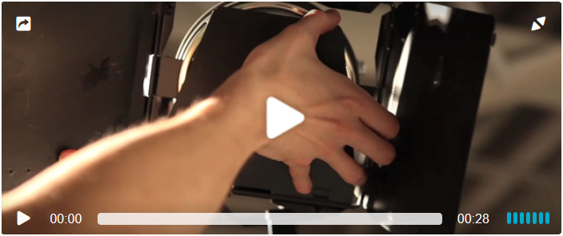

*   [Skinning with CSS](#skinning-with-css)
*   + [Loading the skin](#loading-the-skin)
    *   [Server side](#server-side)
*   + [Brand colors](#brand-colors)
    *   [Brand](#brand)
    *   [Control bar](#control-bar)
    *   [Play button](#play-button)
    *   [Canvas](#canvas)
*   + [Themes](#themes)
    *   [Default](#default)
    *   [Minimal](#minimal)
    *   [Playful](#playful)
    *   [Fixed controls](#fixed-controls)
*   + [Timeline](#timeline)
    *   [Slim](#slim)
    *   [Full](#full)
    *   [Fat](#fat)
    *   [No buffer](#no-buffer)
*   + [Icons](#icons)
    *   [Edgy](#edgy)
    *   [Outlined](#outlined)
    *   [Mute button](#mute-button)
    *   [No volume](#no-volume)
    *   [Combined](#combined)
    *   [Extension icons](#extension-icons)
*   [Right to left support](#rtl)
*   + [States](#states)
    *   [Configurable states](#configurable-states)
    *   [Extension and plugin states](#extension-and-plugin-states)
*   + [HTML layout](#html-layout)
    *   [Custom controls](#custom-controls)
        *   [Hiding controls](#hiding-controls)
        *   [Adding controls](#adding-controls)
    *   [Custom UI elements](#custom-ui-elements)
    *   [fp-toggle](#fp-toggle)
*   + [Commercial features](#commercial-features)
    *   [Context menu](#context-menu)
    *   [Logo](#logo)
*   [Migration from Version 6](#migration-from-version-6)


# Skinning with CSS

The Flowplayer skin is designed with [CSS3](http://www.w3schools.com/css/css3_intro.asp). It offers extreme flexibility when it comes to customization.

There are various approaches to tailor the design to your wishes:

1.  change the [brand colors](#brand-colors) via CSS
2.  add CSS **modifier** classes to the container element to pick a [theme](#themes) and change [icons](#icons) and [timeline controls](#timeline)
3.  override some directives with your own CSS
4.  clone our default skins and edit them - the skin resources are managed in [GitHub](http://github.com/flowplayer/flowplayer/tree/master/skin)
5.  write a skin from scratch

Typically you use a combination of 1, 2, and 3.


# Loading the skin

The skin [stylesheet](//releases.flowplayer.org/7.0.4/skin/skin.css) is loaded in the HEAD section of the page:

```html
<link rel="stylesheet" href="//releases.flowplayer.org/7.0.4/skin/skin.css">
```

To use the skin you can:

1.  download it and put it on your [server](#server-side) or
2.  load it directly from our CDN URL as shown above


## Server side

The Flowplayer skin also contain fonts instead of graphics for fast loading. The font files must be served on a loose cross-origin policy ([CORS](https://developer.mozilla.org/en-US/docs/Web/HTTP/Access_control_CORS)) with an appropriate `Access-Control-Allow-Origin` header if they are loaded from a different domain, for instance when the player is [shared](sharing.html).

Simple apache sample config:

```
Header set Access-Control-Allow-Origin "*"
```

For more details look up [cross-orgin resource sharing](http://enable-cors.org/).


# Brand colors

The most decisive aspect in making the player "yours" is to set the brand color.


## Brand

Change the color of the progress bar and active menu items with a CSS directive for the `fp-color` class:

```css
.flowplayer .fp-color {
  background-color: #373484;
}
```

Default color: `#00abcd`.


## Control bar

```css
.flowplayer .fp-controls {
  background-color: #ec6c4c;
}
```

By default the control bar background is transparent.

## Play button

The big play button in the center of the screen can be emphasized with circled background color:

```css
.flowplayer .fp-color-play {
  fill: #ec6c4c;
}
```

Flowplayer's handling of the on-screen play button is unconventional: It is only visible until playback is initiated. From then only pause and play action indicators alert to the change of player state at the moment of pausing or resuming.

The player can still be customize to feature the traditional approach of showing a center-screen play button during pause as in [this demo](http://demos.flowplayer.org/lookandfeel/traditional-play-button.html).


## Canvas

The player canvas is normally visible only when the video is letterboxed or pillarboxed in fullscreen more, or during the transition from one playlist item to another. Its color is dark grey: `#333`.

Make the canvas black:

```css
.flowplayer.is-ready .fp-player {
  background-color: #000;
}
```

See also the `bgcolor` [option](setup.html#player-options) for the Flash failover.

For HTML5 video even the canvas color can be used for effect and changed dynamically. Play [this](http://demos.flowplayer.org/playlist/adverts-in-playlist) in fullscreen.

# Themes

Three themes are available for the overall look of the player.

## Default

This is how the skin looks like without and modifications:



```html
<div class="flowplayer"
     data-aspect-ratio="12:5">
   <video>
      <source type="video/webm"
              src="//edge.flowplayer.org/functional.webm">
      <source type="video/mp4"
              src="//edge.flowplayer.org/functional.mp4">
      </video>
</div>
```

[view standalone page](https://flowplayer.org/standalone/skin/default.html)

## Minimal

A highly stripped mode when not in fullscreen mode with just a short and slim [timeline](#timeline). In fullscreen all the configured buttons are visible and the timeline is usable. [Outlined icons](#outlined) only. Use on special occasions when you don't want the player skin to be in the way at all.

Set up by adding the `fp-minimal` class to the container element.


```html
<div class="flowplayer fp-minimal"
     data-aspect-ratio="12:5">
   <video>
      <source type="video/webm"
              src="//edge.flowplayer.org/functional.webm">
      <source type="video/mp4"
              src="//edge.flowplayer.org/functional.mp4">
      </video>
</div>
```


[view standalone page](/standalone/skin/minimal.html)


## Playful

The playful theme uses the [fat](#fat) (tall) [timeline](#timeline) design with <span style="background-color:#006680;color:#fff">petrol</span> `#006680` background color and <span style="color:#ec6c4c">orange</span> `#ec6c4c` brand color.

Set up by adding the `fp-playful` class to the container element.

```html
<div class="flowplayer fp-playful"
     data-aspect-ratio="12:5">
   <video>
      <source type="video/webm"
              src="//edge.flowplayer.org/functional.webm">
      <source type="video/mp4"
              src="//edge.flowplayer.org/functional.mp4">
      </video>
</div>
```

## Fixed controls

Normally player controls are shown when hovering over the player or in paused [state](#states). By adding the `no-toggle` class to the container element you can make them stick and always visible.

<div class="flowplayer no-toggle is-mouseover fp-default-playlist is-ready is-paused" data-aspect-ratio="12:5" data-flowplayer-instance-id="3">

<div class="fp-player">

<div class="fp-ui">

<div class="fp-header"><a class="fp-share fp-icon"></a><a class="fp-fullscreen fp-icon"></a><a class="fp-unload fp-icon"></a></div>

<div class="fp-play fp-visible"><a class="fp-icon fp-playbtn"></a><svg class="fp-play-rounded-fill" xmlns="http://www.w3.org/2000/svg" viewBox="0 0 100 100"><defs><style>.a { fill: #000; opacity: 0.65; } .b { fill: #fff; opacity: 1.0; }</style></defs> <title>play-rounded-fill</title> </svg><svg class="fp-play-rounded-outline" xmlns="http://www.w3.org/2000/svg" viewBox="0 0 99.844 99.8434"><defs><style>.fp-color-play { opacity: 0.65; } .controlbutton { fill: #fff; }</style></defs> <title>play-rounded-outline</title> </svg><svg class="fp-play-sharp-fill" xmlns="http://www.w3.org/2000/svg" viewBox="0 0 100 100"><defs><style>.fp-color-play { opacity: 0.65; } .controlbutton { fill: #fff; }</style></defs> <title>play-sharp-fill</title> </svg><svg class="fp-play-sharp-outline" xmlns="http://www.w3.org/2000/svg" viewBox="0 0 99.844 99.8434"><defs><style>.controlbuttonbg { opacity: 0.65; } .controlbutton { fill: #fff; }</style></defs> <title>play-sharp-outline</title></svg></div>

<div class="fp-pause"><a class="fp-icon fp-playbtn"></a><svg class="fp-pause-sharp-outline" xmlns="http://www.w3.org/2000/svg" viewBox="0 0 99.8434 99.8434"><defs><style>.fp-color-play { opacity: 0.65; } .rect { fill: #fff; }</style></defs> <title>pause-sharp-outline</title> </svg><svg class="fp-pause-sharp-fill" xmlns="http://www.w3.org/2000/svg" viewBox="0 0 100 100"><defs><style>.fp-color-play { opacity: 0.65; } .rect { fill: #fff; }</style></defs> <title>pause-sharp-fill</title> </svg><svg class="fp-pause-rounded-outline" xmlns="http://www.w3.org/2000/svg" viewBox="0 0 99.8434 99.8434"><defs><style>.fp-color-play { opacity: 0.65; } .rect { fill: #fff; }</style></defs> <title>pause-rounded-outline</title> </svg><svg class="fp-pause-rounded-fill" xmlns="http://www.w3.org/2000/svg" viewBox="0 0 100 100"><defs><style>.fp-color-play { opacity: 0.65; } .rect { fill: #fff; }</style></defs> <title>pause-rounded-fill</title></svg></div>

<div class="fp-controls"><a class="fp-icon fp-playbtn"></a><span class="fp-elapsed">00:00</span>

<div class="fp-timeline fp-bar"><span class="fp-timestamp"></span></div>

<span class="fp-duration">00:28</span> <span class="fp-remaining">00:28</span>

<div class="fp-volume"><a class="fp-icon fp-volumebtn"></a></div>

**CC**</div>

<div class="fp-menu fp-share-menu">**Share**<a class="fp-icon fp-twitter">Twitter</a><a class="fp-icon fp-embed" title="Copy to your site">Embed</a></div>

<div class="fp-menu fp-subtitle-menu">**Closed Captions**<a data-subtitle-index="-1" class="fp-selected">No subtitles</a></div>

</div>

<div class="fp-help"><a class="fp-close"></a>

<div class="fp-help-section fp-help-basics">

_space_play / pause

_q_unload | stop

_f_fullscreen

_shift_ + _←__→_slower / faster

</div>

<div class="fp-help-section">

_↑__↓_volume

_m_mute

</div>

<div class="fp-help-section">

_←__→_seek

_ ._ seek to previous

_1__2_… _6_ seek to 10%, 20% … 60%

</div>

</div>

<div class="fp-context-menu fp-menu">**© 2017 Flowplayer**[About Flowplayer](https://flowplayer.org/hello)[GPL based license](https://flowplayer.org/license)</div>

</div>

[](https://flowplayer.org/hello)</div>

<div class="help">[<span class="codetogglehint">show</span> HTML code](#)</div>

<div id="fpnotoggle-html" class="codetoggle">

<div class="codebox">

<figure class="code">

<div class="highlight">

<pre><span></span><span class="p"><</span><span class="nt">div</span> <span class="na">class</span><span class="o">=</span><span class="s">"flowplayer no-toggle"</span>  
     <span class="na">data-aspect-ratio</span><span class="o">=</span><span class="s">"12:5"</span><span class="p">></span>  
   <span class="p"><</span><span class="nt">video</span><span class="p">></span>  
      <span class="p"><</span><span class="nt">source</span> <span class="na">type</span><span class="o">=</span><span class="s">"video/webm"</span>  
              <span class="na">src</span><span class="o">=</span><span class="s">"//edge.flowplayer.org/functional.webm"</span><span class="p">></span>  
      <span class="p"><</span><span class="nt">source</span> <span class="na">type</span><span class="o">=</span><span class="s">"video/mp4"</span>  
              <span class="na">src</span><span class="o">=</span><span class="s">"//edge.flowplayer.org/functional.mp4"</span><span class="p">></span>  
      <span class="p"></</span><span class="nt">video</span><span class="p">></span>  
<span class="p"></</span><span class="nt">div</span><span class="p">></span>  
</pre>

</div>

<figcaption>HTML</figcaption>

</figure>

</div>

<div class="help">[<span class="codetogglehint">show</span> HTML code](#)</div>

</div>

[view standalone page](/standalone/skin/no-toggle.html)

</section>

</section>

<section class="level1 has4" id="section_timeline">

# Timeline

Change the looks of the timeline with CSS classes.

<section class="level2" id="section_slim">

## Slim

A slim timeline, expanding on mouseover, can be set up by adding the `fp-slim` class to the container element.

<div class="flowplayer fp-slim fp-default-playlist is-ready is-paused is-mouseout" data-aspect-ratio="12:5" data-flowplayer-instance-id="4">

<div class="fp-player">

<div class="fp-ui">

<div class="fp-header"><a class="fp-share fp-icon"></a><a class="fp-fullscreen fp-icon"></a><a class="fp-unload fp-icon"></a></div>

<div class="fp-play fp-visible"><a class="fp-icon fp-playbtn"></a><svg class="fp-play-rounded-fill" xmlns="http://www.w3.org/2000/svg" viewBox="0 0 100 100"><defs><style>.a { fill: #000; opacity: 0.65; } .b { fill: #fff; opacity: 1.0; }</style></defs> <title>play-rounded-fill</title> </svg><svg class="fp-play-rounded-outline" xmlns="http://www.w3.org/2000/svg" viewBox="0 0 99.844 99.8434"><defs><style>.fp-color-play { opacity: 0.65; } .controlbutton { fill: #fff; }</style></defs> <title>play-rounded-outline</title> </svg><svg class="fp-play-sharp-fill" xmlns="http://www.w3.org/2000/svg" viewBox="0 0 100 100"><defs><style>.fp-color-play { opacity: 0.65; } .controlbutton { fill: #fff; }</style></defs> <title>play-sharp-fill</title> </svg><svg class="fp-play-sharp-outline" xmlns="http://www.w3.org/2000/svg" viewBox="0 0 99.844 99.8434"><defs><style>.controlbuttonbg { opacity: 0.65; } .controlbutton { fill: #fff; }</style></defs> <title>play-sharp-outline</title></svg></div>

<div class="fp-pause"><a class="fp-icon fp-playbtn"></a><svg class="fp-pause-sharp-outline" xmlns="http://www.w3.org/2000/svg" viewBox="0 0 99.8434 99.8434"><defs><style>.fp-color-play { opacity: 0.65; } .rect { fill: #fff; }</style></defs> <title>pause-sharp-outline</title> </svg><svg class="fp-pause-sharp-fill" xmlns="http://www.w3.org/2000/svg" viewBox="0 0 100 100"><defs><style>.fp-color-play { opacity: 0.65; } .rect { fill: #fff; }</style></defs> <title>pause-sharp-fill</title> </svg><svg class="fp-pause-rounded-outline" xmlns="http://www.w3.org/2000/svg" viewBox="0 0 99.8434 99.8434"><defs><style>.fp-color-play { opacity: 0.65; } .rect { fill: #fff; }</style></defs> <title>pause-rounded-outline</title> </svg><svg class="fp-pause-rounded-fill" xmlns="http://www.w3.org/2000/svg" viewBox="0 0 100 100"><defs><style>.fp-color-play { opacity: 0.65; } .rect { fill: #fff; }</style></defs> <title>pause-rounded-fill</title></svg></div>

<div class="fp-controls"><a class="fp-icon fp-playbtn"></a><span class="fp-elapsed">00:00</span>

<div class="fp-timeline fp-bar"><span class="fp-timestamp"></span></div>

<span class="fp-duration">00:28</span> <span class="fp-remaining">00:28</span>

<div class="fp-volume"><a class="fp-icon fp-volumebtn"></a></div>

**CC**</div>

<div class="fp-menu fp-share-menu">**Share**<a class="fp-icon fp-twitter">Twitter</a><a class="fp-icon fp-embed" title="Copy to your site">Embed</a></div>

<div class="fp-menu fp-subtitle-menu">**Closed Captions**<a data-subtitle-index="-1" class="fp-selected">No subtitles</a></div>

</div>

<div class="fp-help"><a class="fp-close"></a>

<div class="fp-help-section fp-help-basics">

_space_play / pause

_q_unload | stop

_f_fullscreen

_shift_ + _←__→_slower / faster

</div>

<div class="fp-help-section">

_↑__↓_volume

_m_mute

</div>

<div class="fp-help-section">

_←__→_seek

_ ._ seek to previous

_1__2_… _6_ seek to 10%, 20% … 60%

</div>

</div>

<div class="fp-context-menu fp-menu">**© 2017 Flowplayer**[About Flowplayer](https://flowplayer.org/hello)[GPL based license](https://flowplayer.org/license)</div>

</div>

[](https://flowplayer.org/hello)</div>

<div class="help">[<span class="codetogglehint">show</span> HTML code](#)</div>

<div id="fpslim-html" class="codetoggle">

<div class="codebox">

<figure class="code">

<div class="highlight">

<pre><span></span><span class="p"><</span><span class="nt">div</span> <span class="na">class</span><span class="o">=</span><span class="s">"flowplayer fp-slim"</span>  
     <span class="na">data-aspect-ratio</span><span class="o">=</span><span class="s">"12:5"</span><span class="p">></span>  
   <span class="p"><</span><span class="nt">video</span><span class="p">></span>  
      <span class="p"><</span><span class="nt">source</span> <span class="na">type</span><span class="o">=</span><span class="s">"video/webm"</span>  
              <span class="na">src</span><span class="o">=</span><span class="s">"//edge.flowplayer.org/functional.webm"</span><span class="p">></span>  
      <span class="p"><</span><span class="nt">source</span> <span class="na">type</span><span class="o">=</span><span class="s">"video/mp4"</span>  
              <span class="na">src</span><span class="o">=</span><span class="s">"//edge.flowplayer.org/functional.mp4"</span><span class="p">></span>  
      <span class="p"></</span><span class="nt">video</span><span class="p">></span>  
<span class="p"></</span><span class="nt">div</span><span class="p">></span>  
</pre>

</div>

<figcaption>HTML</figcaption>

</figure>

</div>

<div class="help">[<span class="codetogglehint">show</span> HTML code](#)</div>

</div>

[view standalone page](/standalone/skin/slim.html)

</section>

<section class="level2" id="section_full">

## Full

Positions the timeline above the controlbar buttons and makes it span the whole width, similar to the YouTube player. Can be set up by adding the `fp-full` class to the container element.

<div class="flowplayer fp-full fp-default-playlist is-ready is-paused is-mouseout" data-aspect-ratio="12:5" data-flowplayer-instance-id="5">

<div class="fp-player">

<div class="fp-ui">

<div class="fp-header"><a class="fp-share fp-icon"></a><a class="fp-fullscreen fp-icon"></a><a class="fp-unload fp-icon"></a></div>

<div class="fp-play fp-visible"><a class="fp-icon fp-playbtn"></a><svg class="fp-play-rounded-fill" xmlns="http://www.w3.org/2000/svg" viewBox="0 0 100 100"><defs><style>.a { fill: #000; opacity: 0.65; } .b { fill: #fff; opacity: 1.0; }</style></defs> <title>play-rounded-fill</title> </svg><svg class="fp-play-rounded-outline" xmlns="http://www.w3.org/2000/svg" viewBox="0 0 99.844 99.8434"><defs><style>.fp-color-play { opacity: 0.65; } .controlbutton { fill: #fff; }</style></defs> <title>play-rounded-outline</title> </svg><svg class="fp-play-sharp-fill" xmlns="http://www.w3.org/2000/svg" viewBox="0 0 100 100"><defs><style>.fp-color-play { opacity: 0.65; } .controlbutton { fill: #fff; }</style></defs> <title>play-sharp-fill</title> </svg><svg class="fp-play-sharp-outline" xmlns="http://www.w3.org/2000/svg" viewBox="0 0 99.844 99.8434"><defs><style>.controlbuttonbg { opacity: 0.65; } .controlbutton { fill: #fff; }</style></defs> <title>play-sharp-outline</title></svg></div>

<div class="fp-pause"><a class="fp-icon fp-playbtn"></a><svg class="fp-pause-sharp-outline" xmlns="http://www.w3.org/2000/svg" viewBox="0 0 99.8434 99.8434"><defs><style>.fp-color-play { opacity: 0.65; } .rect { fill: #fff; }</style></defs> <title>pause-sharp-outline</title> </svg><svg class="fp-pause-sharp-fill" xmlns="http://www.w3.org/2000/svg" viewBox="0 0 100 100"><defs><style>.fp-color-play { opacity: 0.65; } .rect { fill: #fff; }</style></defs> <title>pause-sharp-fill</title> </svg><svg class="fp-pause-rounded-outline" xmlns="http://www.w3.org/2000/svg" viewBox="0 0 99.8434 99.8434"><defs><style>.fp-color-play { opacity: 0.65; } .rect { fill: #fff; }</style></defs> <title>pause-rounded-outline</title> </svg><svg class="fp-pause-rounded-fill" xmlns="http://www.w3.org/2000/svg" viewBox="0 0 100 100"><defs><style>.fp-color-play { opacity: 0.65; } .rect { fill: #fff; }</style></defs> <title>pause-rounded-fill</title></svg></div>

<div class="fp-controls"><a class="fp-icon fp-playbtn"></a><span class="fp-elapsed">00:00</span>

<div class="fp-timeline fp-bar"><span class="fp-timestamp"></span></div>

<span class="fp-duration">00:28</span> <span class="fp-remaining">00:28</span>

<div class="fp-volume"><a class="fp-icon fp-volumebtn"></a></div>

**CC**</div>

<div class="fp-menu fp-share-menu">**Share**<a class="fp-icon fp-twitter">Twitter</a><a class="fp-icon fp-embed" title="Copy to your site">Embed</a></div>

<div class="fp-menu fp-subtitle-menu">**Closed Captions**<a data-subtitle-index="-1" class="fp-selected">No subtitles</a></div>

</div>

<div class="fp-help"><a class="fp-close"></a>

<div class="fp-help-section fp-help-basics">

_space_play / pause

_q_unload | stop

_f_fullscreen

_shift_ + _←__→_slower / faster

</div>

<div class="fp-help-section">

_↑__↓_volume

_m_mute

</div>

<div class="fp-help-section">

_←__→_seek

_ ._ seek to previous

_1__2_… _6_ seek to 10%, 20% … 60%

</div>

</div>

<div class="fp-context-menu fp-menu">**© 2017 Flowplayer**[About Flowplayer](https://flowplayer.org/hello)[GPL based license](https://flowplayer.org/license)</div>

</div>

[](https://flowplayer.org/hello)</div>

<div class="help">[<span class="codetogglehint">show</span> HTML code](#)</div>

<div id="fpfull-html" class="codetoggle">

<div class="codebox">

<figure class="code">

<div class="highlight">

<pre><span></span><span class="p"><</span><span class="nt">div</span> <span class="na">class</span><span class="o">=</span><span class="s">"flowplayer fp-full"</span>  
     <span class="na">data-aspect-ratio</span><span class="o">=</span><span class="s">"12:5"</span><span class="p">></span>  
   <span class="p"><</span><span class="nt">video</span><span class="p">></span>  
      <span class="p"><</span><span class="nt">source</span> <span class="na">type</span><span class="o">=</span><span class="s">"video/webm"</span>  
              <span class="na">src</span><span class="o">=</span><span class="s">"//edge.flowplayer.org/functional.webm"</span><span class="p">></span>  
      <span class="p"><</span><span class="nt">source</span> <span class="na">type</span><span class="o">=</span><span class="s">"video/mp4"</span>  
              <span class="na">src</span><span class="o">=</span><span class="s">"//edge.flowplayer.org/functional.mp4"</span><span class="p">></span>  
      <span class="p"></</span><span class="nt">video</span><span class="p">></span>  
<span class="p"></</span><span class="nt">div</span><span class="p">></span>  
</pre>

</div>

<figcaption>HTML</figcaption>

</figure>

</div>

<div class="help">[<span class="codetogglehint">show</span> HTML code](#)</div>

</div>

[view standalone page](/standalone/skin/full.html)

</section>

<section class="level2" id="section_fat">

## Fat

To enhance the prominence of the brand color with a tall timeline add the `fp-fat` class to the container element.

<div class="flowplayer fp-fat is-mouseout fp-default-playlist is-ready is-paused" data-aspect-ratio="12:5" data-flowplayer-instance-id="6">

<div class="fp-player">

<div class="fp-ui">

<div class="fp-header"><a class="fp-share fp-icon"></a><a class="fp-fullscreen fp-icon"></a><a class="fp-unload fp-icon"></a></div>

<div class="fp-play fp-visible"><a class="fp-icon fp-playbtn"></a><svg class="fp-play-rounded-fill" xmlns="http://www.w3.org/2000/svg" viewBox="0 0 100 100"><defs><style>.a { fill: #000; opacity: 0.65; } .b { fill: #fff; opacity: 1.0; }</style></defs> <title>play-rounded-fill</title> </svg><svg class="fp-play-rounded-outline" xmlns="http://www.w3.org/2000/svg" viewBox="0 0 99.844 99.8434"><defs><style>.fp-color-play { opacity: 0.65; } .controlbutton { fill: #fff; }</style></defs> <title>play-rounded-outline</title> </svg><svg class="fp-play-sharp-fill" xmlns="http://www.w3.org/2000/svg" viewBox="0 0 100 100"><defs><style>.fp-color-play { opacity: 0.65; } .controlbutton { fill: #fff; }</style></defs> <title>play-sharp-fill</title> </svg><svg class="fp-play-sharp-outline" xmlns="http://www.w3.org/2000/svg" viewBox="0 0 99.844 99.8434"><defs><style>.controlbuttonbg { opacity: 0.65; } .controlbutton { fill: #fff; }</style></defs> <title>play-sharp-outline</title></svg></div>

<div class="fp-pause"><a class="fp-icon fp-playbtn"></a><svg class="fp-pause-sharp-outline" xmlns="http://www.w3.org/2000/svg" viewBox="0 0 99.8434 99.8434"><defs><style>.fp-color-play { opacity: 0.65; } .rect { fill: #fff; }</style></defs> <title>pause-sharp-outline</title> </svg><svg class="fp-pause-sharp-fill" xmlns="http://www.w3.org/2000/svg" viewBox="0 0 100 100"><defs><style>.fp-color-play { opacity: 0.65; } .rect { fill: #fff; }</style></defs> <title>pause-sharp-fill</title> </svg><svg class="fp-pause-rounded-outline" xmlns="http://www.w3.org/2000/svg" viewBox="0 0 99.8434 99.8434"><defs><style>.fp-color-play { opacity: 0.65; } .rect { fill: #fff; }</style></defs> <title>pause-rounded-outline</title> </svg><svg class="fp-pause-rounded-fill" xmlns="http://www.w3.org/2000/svg" viewBox="0 0 100 100"><defs><style>.fp-color-play { opacity: 0.65; } .rect { fill: #fff; }</style></defs> <title>pause-rounded-fill</title></svg></div>

<div class="fp-controls"><a class="fp-icon fp-playbtn"></a><span class="fp-elapsed">00:00</span>

<div class="fp-timeline fp-bar"><span class="fp-timestamp"></span></div>

<span class="fp-duration">00:28</span> <span class="fp-remaining">00:28</span>

<div class="fp-volume"><a class="fp-icon fp-volumebtn"></a></div>

**CC**</div>

<div class="fp-menu fp-share-menu">**Share**<a class="fp-icon fp-twitter">Twitter</a><a class="fp-icon fp-embed" title="Copy to your site">Embed</a></div>

<div class="fp-menu fp-subtitle-menu">**Closed Captions**<a data-subtitle-index="-1" class="fp-selected">No subtitles</a></div>

</div>

<div class="fp-help"><a class="fp-close"></a>

<div class="fp-help-section fp-help-basics">

_space_play / pause

_q_unload | stop

_f_fullscreen

_shift_ + _←__→_slower / faster

</div>

<div class="fp-help-section">

_↑__↓_volume

_m_mute

</div>

<div class="fp-help-section">

_←__→_seek

_ ._ seek to previous

_1__2_… _6_ seek to 10%, 20% … 60%

</div>

</div>

<div class="fp-context-menu fp-menu">**© 2017 Flowplayer**[About Flowplayer](https://flowplayer.org/hello)[GPL based license](https://flowplayer.org/license)</div>

</div>

[](https://flowplayer.org/hello)</div>

<div class="help">[<span class="codetogglehint">show</span> HTML code](#)</div>

<div id="fpfat-html" class="codetoggle">

<div class="codebox">

<figure class="code">

<div class="highlight">

<pre><span></span><span class="p"><</span><span class="nt">div</span> <span class="na">class</span><span class="o">=</span><span class="s">"flowplayer fp-fat"</span>  
     <span class="na">data-aspect-ratio</span><span class="o">=</span><span class="s">"12:5"</span><span class="p">></span>  
   <span class="p"><</span><span class="nt">video</span><span class="p">></span>  
      <span class="p"><</span><span class="nt">source</span> <span class="na">type</span><span class="o">=</span><span class="s">"video/webm"</span>  
              <span class="na">src</span><span class="o">=</span><span class="s">"//edge.flowplayer.org/functional.webm"</span><span class="p">></span>  
      <span class="p"><</span><span class="nt">source</span> <span class="na">type</span><span class="o">=</span><span class="s">"video/mp4"</span>  
              <span class="na">src</span><span class="o">=</span><span class="s">"//edge.flowplayer.org/functional.mp4"</span><span class="p">></span>  
      <span class="p"></</span><span class="nt">video</span><span class="p">></span>  
<span class="p"></</span><span class="nt">div</span><span class="p">></span>  
</pre>

</div>

<figcaption>HTML</figcaption>

</figure>

</div>

<div class="help">[<span class="codetogglehint">show</span> HTML code](#)</div>

</div>

[view standalone page](/standalone/skin/fat.html)

See also the [playful theme](#playful).

</section>

<section class="level2" id="section_no-buffer">

## No buffer

The buffer indicator can be removed by adding the `no-buffer` class to the container element.

<div class="flowplayer no-buffer fp-default-playlist is-ready is-paused is-mouseout" data-aspect-ratio="12:5" data-flowplayer-instance-id="7">

<div class="fp-player">

<div class="fp-ui">

<div class="fp-header"><a class="fp-share fp-icon"></a><a class="fp-fullscreen fp-icon"></a><a class="fp-unload fp-icon"></a></div>

<div class="fp-play fp-visible"><a class="fp-icon fp-playbtn"></a><svg class="fp-play-rounded-fill" xmlns="http://www.w3.org/2000/svg" viewBox="0 0 100 100"><defs><style>.a { fill: #000; opacity: 0.65; } .b { fill: #fff; opacity: 1.0; }</style></defs> <title>play-rounded-fill</title> </svg><svg class="fp-play-rounded-outline" xmlns="http://www.w3.org/2000/svg" viewBox="0 0 99.844 99.8434"><defs><style>.fp-color-play { opacity: 0.65; } .controlbutton { fill: #fff; }</style></defs> <title>play-rounded-outline</title> </svg><svg class="fp-play-sharp-fill" xmlns="http://www.w3.org/2000/svg" viewBox="0 0 100 100"><defs><style>.fp-color-play { opacity: 0.65; } .controlbutton { fill: #fff; }</style></defs> <title>play-sharp-fill</title> </svg><svg class="fp-play-sharp-outline" xmlns="http://www.w3.org/2000/svg" viewBox="0 0 99.844 99.8434"><defs><style>.controlbuttonbg { opacity: 0.65; } .controlbutton { fill: #fff; }</style></defs> <title>play-sharp-outline</title></svg></div>

<div class="fp-pause"><a class="fp-icon fp-playbtn"></a><svg class="fp-pause-sharp-outline" xmlns="http://www.w3.org/2000/svg" viewBox="0 0 99.8434 99.8434"><defs><style>.fp-color-play { opacity: 0.65; } .rect { fill: #fff; }</style></defs> <title>pause-sharp-outline</title> </svg><svg class="fp-pause-sharp-fill" xmlns="http://www.w3.org/2000/svg" viewBox="0 0 100 100"><defs><style>.fp-color-play { opacity: 0.65; } .rect { fill: #fff; }</style></defs> <title>pause-sharp-fill</title> </svg><svg class="fp-pause-rounded-outline" xmlns="http://www.w3.org/2000/svg" viewBox="0 0 99.8434 99.8434"><defs><style>.fp-color-play { opacity: 0.65; } .rect { fill: #fff; }</style></defs> <title>pause-rounded-outline</title> </svg><svg class="fp-pause-rounded-fill" xmlns="http://www.w3.org/2000/svg" viewBox="0 0 100 100"><defs><style>.fp-color-play { opacity: 0.65; } .rect { fill: #fff; }</style></defs> <title>pause-rounded-fill</title></svg></div>

<div class="fp-controls"><a class="fp-icon fp-playbtn"></a><span class="fp-elapsed">00:00</span>

<div class="fp-timeline fp-bar"><span class="fp-timestamp"></span></div>

<span class="fp-duration">00:28</span> <span class="fp-remaining">00:28</span>

<div class="fp-volume"><a class="fp-icon fp-volumebtn"></a></div>

**CC**</div>

<div class="fp-menu fp-share-menu">**Share**<a class="fp-icon fp-twitter">Twitter</a><a class="fp-icon fp-embed" title="Copy to your site">Embed</a></div>

<div class="fp-menu fp-subtitle-menu">**Closed Captions**<a data-subtitle-index="-1" class="fp-selected">No subtitles</a></div>

</div>

<div class="fp-help"><a class="fp-close"></a>

<div class="fp-help-section fp-help-basics">

_space_play / pause

_q_unload | stop

_f_fullscreen

_shift_ + _←__→_slower / faster

</div>

<div class="fp-help-section">

_↑__↓_volume

_m_mute

</div>

<div class="fp-help-section">

_←__→_seek

_ ._ seek to previous

_1__2_… _6_ seek to 10%, 20% … 60%

</div>

</div>

<div class="fp-context-menu fp-menu">**© 2017 Flowplayer**[About Flowplayer](https://flowplayer.org/hello)[GPL based license](https://flowplayer.org/license)</div>

</div>

[](https://flowplayer.org/hello)</div>

<div class="help">[<span class="codetogglehint">show</span> HTML code](#)</div>

<div id="fpnobuffer-html" class="codetoggle">

<div class="codebox">

<figure class="code">

<div class="highlight">

<pre><span></span><span class="p"><</span><span class="nt">div</span> <span class="na">class</span><span class="o">=</span><span class="s">"flowplayer no-buffer"</span>  
     <span class="na">data-aspect-ratio</span><span class="o">=</span><span class="s">"12:5"</span><span class="p">></span>  
   <span class="p"><</span><span class="nt">video</span><span class="p">></span>  
      <span class="p"><</span><span class="nt">source</span> <span class="na">type</span><span class="o">=</span><span class="s">"video/webm"</span>  
              <span class="na">src</span><span class="o">=</span><span class="s">"//edge.flowplayer.org/functional.webm"</span><span class="p">></span>  
      <span class="p"><</span><span class="nt">source</span> <span class="na">type</span><span class="o">=</span><span class="s">"video/mp4"</span>  
              <span class="na">src</span><span class="o">=</span><span class="s">"//edge.flowplayer.org/functional.mp4"</span><span class="p">></span>  
      <span class="p"></</span><span class="nt">video</span><span class="p">></span>  
<span class="p"></</span><span class="nt">div</span><span class="p">></span>  
</pre>

</div>

<figcaption>HTML</figcaption>

</figure>

</div>

<div class="help">[<span class="codetogglehint">show</span> HTML code](#)</div>

</div>

[view standalone page](/standalone/skin/no-buffer.html)

</section>

</section>

<section class="level1 has6" id="section_icons">

# Icons

Customize the look of, and add/remove interactive icons with CSS classes.

<section class="level2" id="section_edgy">

## Edgy

Angular icons are set up by adding the `fp-edgy` class to the container element.

<div class="flowplayer fp-edgy fp-default-playlist is-ready is-paused is-mouseout" data-aspect-ratio="12:5" data-flowplayer-instance-id="8">

<div class="fp-player">

<div class="fp-ui">

<div class="fp-header"><a class="fp-share fp-icon"></a><a class="fp-fullscreen fp-icon"></a><a class="fp-unload fp-icon"></a></div>

<div class="fp-play fp-visible"><a class="fp-icon fp-playbtn"></a><svg class="fp-play-rounded-fill" xmlns="http://www.w3.org/2000/svg" viewBox="0 0 100 100"><defs><style>.a { fill: #000; opacity: 0.65; } .b { fill: #fff; opacity: 1.0; }</style></defs> <title>play-rounded-fill</title> </svg><svg class="fp-play-rounded-outline" xmlns="http://www.w3.org/2000/svg" viewBox="0 0 99.844 99.8434"><defs><style>.fp-color-play { opacity: 0.65; } .controlbutton { fill: #fff; }</style></defs> <title>play-rounded-outline</title> </svg><svg class="fp-play-sharp-fill" xmlns="http://www.w3.org/2000/svg" viewBox="0 0 100 100"><defs><style>.fp-color-play { opacity: 0.65; } .controlbutton { fill: #fff; }</style></defs> <title>play-sharp-fill</title> </svg><svg class="fp-play-sharp-outline" xmlns="http://www.w3.org/2000/svg" viewBox="0 0 99.844 99.8434"><defs><style>.controlbuttonbg { opacity: 0.65; } .controlbutton { fill: #fff; }</style></defs> <title>play-sharp-outline</title></svg></div>

<div class="fp-pause"><a class="fp-icon fp-playbtn"></a><svg class="fp-pause-sharp-outline" xmlns="http://www.w3.org/2000/svg" viewBox="0 0 99.8434 99.8434"><defs><style>.fp-color-play { opacity: 0.65; } .rect { fill: #fff; }</style></defs> <title>pause-sharp-outline</title> </svg><svg class="fp-pause-sharp-fill" xmlns="http://www.w3.org/2000/svg" viewBox="0 0 100 100"><defs><style>.fp-color-play { opacity: 0.65; } .rect { fill: #fff; }</style></defs> <title>pause-sharp-fill</title> </svg><svg class="fp-pause-rounded-outline" xmlns="http://www.w3.org/2000/svg" viewBox="0 0 99.8434 99.8434"><defs><style>.fp-color-play { opacity: 0.65; } .rect { fill: #fff; }</style></defs> <title>pause-rounded-outline</title> </svg><svg class="fp-pause-rounded-fill" xmlns="http://www.w3.org/2000/svg" viewBox="0 0 100 100"><defs><style>.fp-color-play { opacity: 0.65; } .rect { fill: #fff; }</style></defs> <title>pause-rounded-fill</title></svg></div>

<div class="fp-controls"><a class="fp-icon fp-playbtn"></a><span class="fp-elapsed">00:00</span>

<div class="fp-timeline fp-bar"><span class="fp-timestamp"></span></div>

<span class="fp-duration">00:28</span> <span class="fp-remaining">00:28</span>

<div class="fp-volume"><a class="fp-icon fp-volumebtn"></a></div>

**CC**</div>

<div class="fp-menu fp-share-menu">**Share**<a class="fp-icon fp-twitter">Twitter</a><a class="fp-icon fp-embed" title="Copy to your site">Embed</a></div>

<div class="fp-menu fp-subtitle-menu">**Closed Captions**<a data-subtitle-index="-1" class="fp-selected">No subtitles</a></div>

</div>

<div class="fp-help"><a class="fp-close"></a>

<div class="fp-help-section fp-help-basics">

_space_play / pause

_q_unload | stop

_f_fullscreen

_shift_ + _←__→_slower / faster

</div>

<div class="fp-help-section">

_↑__↓_volume

_m_mute

</div>

<div class="fp-help-section">

_←__→_seek

_ ._ seek to previous

_1__2_… _6_ seek to 10%, 20% … 60%

</div>

</div>

<div class="fp-context-menu fp-menu">**© 2017 Flowplayer**[About Flowplayer](https://flowplayer.org/hello)[GPL based license](https://flowplayer.org/license)</div>

</div>

[](https://flowplayer.org/hello)</div>

<div class="help">[<span class="codetogglehint">show</span> HTML code](#)</div>

<div id="fpedgy-html" class="codetoggle">

<div class="codebox">

<figure class="code">

<div class="highlight">

<pre><span></span><span class="p"><</span><span class="nt">div</span> <span class="na">class</span><span class="o">=</span><span class="s">"flowplayer fp-edgy"</span>  
     <span class="na">data-aspect-ratio</span><span class="o">=</span><span class="s">"12:5"</span><span class="p">></span>  
   <span class="p"><</span><span class="nt">video</span><span class="p">></span>  
      <span class="p"><</span><span class="nt">source</span> <span class="na">type</span><span class="o">=</span><span class="s">"video/webm"</span>  
              <span class="na">src</span><span class="o">=</span><span class="s">"//edge.flowplayer.org/functional.webm"</span><span class="p">></span>  
      <span class="p"><</span><span class="nt">source</span> <span class="na">type</span><span class="o">=</span><span class="s">"video/mp4"</span>  
              <span class="na">src</span><span class="o">=</span><span class="s">"//edge.flowplayer.org/functional.mp4"</span><span class="p">></span>  
      <span class="p"></</span><span class="nt">video</span><span class="p">></span>  
<span class="p"></</span><span class="nt">div</span><span class="p">></span>  
</pre>

</div>

<figcaption>HTML</figcaption>

</figure>

</div>

<div class="help">[<span class="codetogglehint">show</span> HTML code](#)</div>

</div>

[view standalone page](/standalone/skin/edgy.html)

</section>

<section class="level2" id="section_outlined">

## Outlined

Outlined icons are set up by adding the `fp-outlined` class to the container element.

<div class="flowplayer fp-outlined is-mouseout fp-default-playlist is-ready is-paused" data-aspect-ratio="12:5" data-flowplayer-instance-id="9">

<div class="fp-player">

<div class="fp-ui">

<div class="fp-header"><a class="fp-share fp-icon"></a><a class="fp-fullscreen fp-icon"></a><a class="fp-unload fp-icon"></a></div>

<div class="fp-play fp-visible"><a class="fp-icon fp-playbtn"></a><svg class="fp-play-rounded-fill" xmlns="http://www.w3.org/2000/svg" viewBox="0 0 100 100"><defs><style>.a { fill: #000; opacity: 0.65; } .b { fill: #fff; opacity: 1.0; }</style></defs> <title>play-rounded-fill</title> </svg><svg class="fp-play-rounded-outline" xmlns="http://www.w3.org/2000/svg" viewBox="0 0 99.844 99.8434"><defs><style>.fp-color-play { opacity: 0.65; } .controlbutton { fill: #fff; }</style></defs> <title>play-rounded-outline</title> </svg><svg class="fp-play-sharp-fill" xmlns="http://www.w3.org/2000/svg" viewBox="0 0 100 100"><defs><style>.fp-color-play { opacity: 0.65; } .controlbutton { fill: #fff; }</style></defs> <title>play-sharp-fill</title> </svg><svg class="fp-play-sharp-outline" xmlns="http://www.w3.org/2000/svg" viewBox="0 0 99.844 99.8434"><defs><style>.controlbuttonbg { opacity: 0.65; } .controlbutton { fill: #fff; }</style></defs> <title>play-sharp-outline</title></svg></div>

<div class="fp-pause"><a class="fp-icon fp-playbtn"></a><svg class="fp-pause-sharp-outline" xmlns="http://www.w3.org/2000/svg" viewBox="0 0 99.8434 99.8434"><defs><style>.fp-color-play { opacity: 0.65; } .rect { fill: #fff; }</style></defs> <title>pause-sharp-outline</title> </svg><svg class="fp-pause-sharp-fill" xmlns="http://www.w3.org/2000/svg" viewBox="0 0 100 100"><defs><style>.fp-color-play { opacity: 0.65; } .rect { fill: #fff; }</style></defs> <title>pause-sharp-fill</title> </svg><svg class="fp-pause-rounded-outline" xmlns="http://www.w3.org/2000/svg" viewBox="0 0 99.8434 99.8434"><defs><style>.fp-color-play { opacity: 0.65; } .rect { fill: #fff; }</style></defs> <title>pause-rounded-outline</title> </svg><svg class="fp-pause-rounded-fill" xmlns="http://www.w3.org/2000/svg" viewBox="0 0 100 100"><defs><style>.fp-color-play { opacity: 0.65; } .rect { fill: #fff; }</style></defs> <title>pause-rounded-fill</title></svg></div>

<div class="fp-controls"><a class="fp-icon fp-playbtn"></a><span class="fp-elapsed">00:00</span>

<div class="fp-timeline fp-bar"><span class="fp-timestamp"></span></div>

<span class="fp-duration">00:28</span> <span class="fp-remaining">00:28</span>

<div class="fp-volume"><a class="fp-icon fp-volumebtn"></a></div>

**CC**</div>

<div class="fp-menu fp-share-menu">**Share**<a class="fp-icon fp-twitter">Twitter</a><a class="fp-icon fp-embed" title="Copy to your site">Embed</a></div>

<div class="fp-menu fp-subtitle-menu">**Closed Captions**<a data-subtitle-index="-1" class="fp-selected">No subtitles</a></div>

</div>

<div class="fp-help"><a class="fp-close"></a>

<div class="fp-help-section fp-help-basics">

_space_play / pause

_q_unload | stop

_f_fullscreen

_shift_ + _←__→_slower / faster

</div>

<div class="fp-help-section">

_↑__↓_volume

_m_mute

</div>

<div class="fp-help-section">

_←__→_seek

_ ._ seek to previous

_1__2_… _6_ seek to 10%, 20% … 60%

</div>

</div>

<div class="fp-context-menu fp-menu">**© 2017 Flowplayer**[About Flowplayer](https://flowplayer.org/hello)[GPL based license](https://flowplayer.org/license)</div>

</div>

[](https://flowplayer.org/hello)</div>

<div class="help">[<span class="codetogglehint">show</span> HTML code](#)</div>

<div id="fpoutlined-html" class="codetoggle">

<div class="codebox">

<figure class="code">

<div class="highlight">

<pre><span></span><span class="p"><</span><span class="nt">div</span> <span class="na">class</span><span class="o">=</span><span class="s">"flowplayer fp-outlined"</span>  
     <span class="na">data-aspect-ratio</span><span class="o">=</span><span class="s">"12:5"</span><span class="p">></span>  
   <span class="p"><</span><span class="nt">video</span><span class="p">></span>  
      <span class="p"><</span><span class="nt">source</span> <span class="na">type</span><span class="o">=</span><span class="s">"video/webm"</span>  
              <span class="na">src</span><span class="o">=</span><span class="s">"//edge.flowplayer.org/functional.webm"</span><span class="p">></span>  
      <span class="p"><</span><span class="nt">source</span> <span class="na">type</span><span class="o">=</span><span class="s">"video/mp4"</span>  
              <span class="na">src</span><span class="o">=</span><span class="s">"//edge.flowplayer.org/functional.mp4"</span><span class="p">></span>  
      <span class="p"></</span><span class="nt">video</span><span class="p">></span>  
<span class="p"></</span><span class="nt">div</span><span class="p">></span>  
</pre>

</div>

<figcaption>HTML</figcaption>

</figure>

</div>

<div class="help">[<span class="codetogglehint">show</span> HTML code](#)</div>

</div>

[view standalone page](/standalone/skin/outlined.html)

</section>

<section class="level2" id="section_mute-button">

## Mute button

A mute/unmute button can be added with the `fp-mute` class.

<div class="flowplayer fp-mute is-mouseout fp-default-playlist is-ready is-paused" data-aspect-ratio="12:5" data-flowplayer-instance-id="10">

<div class="fp-player">

<div class="fp-ui">

<div class="fp-header"><a class="fp-share fp-icon"></a><a class="fp-fullscreen fp-icon"></a><a class="fp-unload fp-icon"></a></div>

<div class="fp-play fp-visible"><a class="fp-icon fp-playbtn"></a><svg class="fp-play-rounded-fill" xmlns="http://www.w3.org/2000/svg" viewBox="0 0 100 100"><defs><style>.a { fill: #000; opacity: 0.65; } .b { fill: #fff; opacity: 1.0; }</style></defs> <title>play-rounded-fill</title> </svg><svg class="fp-play-rounded-outline" xmlns="http://www.w3.org/2000/svg" viewBox="0 0 99.844 99.8434"><defs><style>.fp-color-play { opacity: 0.65; } .controlbutton { fill: #fff; }</style></defs> <title>play-rounded-outline</title> </svg><svg class="fp-play-sharp-fill" xmlns="http://www.w3.org/2000/svg" viewBox="0 0 100 100"><defs><style>.fp-color-play { opacity: 0.65; } .controlbutton { fill: #fff; }</style></defs> <title>play-sharp-fill</title> </svg><svg class="fp-play-sharp-outline" xmlns="http://www.w3.org/2000/svg" viewBox="0 0 99.844 99.8434"><defs><style>.controlbuttonbg { opacity: 0.65; } .controlbutton { fill: #fff; }</style></defs> <title>play-sharp-outline</title></svg></div>

<div class="fp-pause"><a class="fp-icon fp-playbtn"></a><svg class="fp-pause-sharp-outline" xmlns="http://www.w3.org/2000/svg" viewBox="0 0 99.8434 99.8434"><defs><style>.fp-color-play { opacity: 0.65; } .rect { fill: #fff; }</style></defs> <title>pause-sharp-outline</title> </svg><svg class="fp-pause-sharp-fill" xmlns="http://www.w3.org/2000/svg" viewBox="0 0 100 100"><defs><style>.fp-color-play { opacity: 0.65; } .rect { fill: #fff; }</style></defs> <title>pause-sharp-fill</title> </svg><svg class="fp-pause-rounded-outline" xmlns="http://www.w3.org/2000/svg" viewBox="0 0 99.8434 99.8434"><defs><style>.fp-color-play { opacity: 0.65; } .rect { fill: #fff; }</style></defs> <title>pause-rounded-outline</title> </svg><svg class="fp-pause-rounded-fill" xmlns="http://www.w3.org/2000/svg" viewBox="0 0 100 100"><defs><style>.fp-color-play { opacity: 0.65; } .rect { fill: #fff; }</style></defs> <title>pause-rounded-fill</title></svg></div>

<div class="fp-controls"><a class="fp-icon fp-playbtn"></a><span class="fp-elapsed">00:00</span>

<div class="fp-timeline fp-bar"><span class="fp-timestamp"></span></div>

<span class="fp-duration">00:28</span> <span class="fp-remaining">00:28</span>

<div class="fp-volume"><a class="fp-icon fp-volumebtn"></a></div>

**CC**</div>

<div class="fp-menu fp-share-menu">**Share**<a class="fp-icon fp-twitter">Twitter</a><a class="fp-icon fp-embed" title="Copy to your site">Embed</a></div>

<div class="fp-menu fp-subtitle-menu">**Closed Captions**<a data-subtitle-index="-1" class="fp-selected">No subtitles</a></div>

</div>

<div class="fp-help"><a class="fp-close"></a>

<div class="fp-help-section fp-help-basics">

_space_play / pause

_q_unload | stop

_f_fullscreen

_shift_ + _←__→_slower / faster

</div>

<div class="fp-help-section">

_↑__↓_volume

_m_mute

</div>

<div class="fp-help-section">

_←__→_seek

_ ._ seek to previous

_1__2_… _6_ seek to 10%, 20% … 60%

</div>

</div>

<div class="fp-context-menu fp-menu">**© 2017 Flowplayer**[About Flowplayer](https://flowplayer.org/hello)[GPL based license](https://flowplayer.org/license)</div>

</div>

[](https://flowplayer.org/hello)</div>

<div class="help">[<span class="codetogglehint">show</span> HTML code](#)</div>

<div id="fpmute-html" class="codetoggle">

<div class="codebox">

<figure class="code">

<div class="highlight">

<pre><span></span><span class="p"><</span><span class="nt">div</span> <span class="na">class</span><span class="o">=</span><span class="s">"flowplayer fp-mute"</span>  
     <span class="na">data-aspect-ratio</span><span class="o">=</span><span class="s">"12:5"</span><span class="p">></span>  
   <span class="p"><</span><span class="nt">video</span><span class="p">></span>  
      <span class="p"><</span><span class="nt">source</span> <span class="na">type</span><span class="o">=</span><span class="s">"video/webm"</span>  
              <span class="na">src</span><span class="o">=</span><span class="s">"//edge.flowplayer.org/functional.webm"</span><span class="p">></span>  
      <span class="p"><</span><span class="nt">source</span> <span class="na">type</span><span class="o">=</span><span class="s">"video/mp4"</span>  
              <span class="na">src</span><span class="o">=</span><span class="s">"//edge.flowplayer.org/functional.mp4"</span><span class="p">></span>  
      <span class="p"></</span><span class="nt">video</span><span class="p">></span>  
<span class="p"></</span><span class="nt">div</span><span class="p">></span>  
</pre>

</div>

<figcaption>HTML</figcaption>

</figure>

</div>

<div class="help">[<span class="codetogglehint">show</span> HTML code](#)</div>

</div>

[view standalone page](/standalone/skin/mute.html)

</section>

<section class="level2" id="section_no-volume">

## No volume

The volume control can be removed by adding the `no-volume` class to the container element. This is done automatically on mobile devices where the volume and can only be changed via device controls.

<div class="flowplayer no-volume is-mouseout fp-default-playlist is-ready is-paused" data-aspect-ratio="12:5" data-flowplayer-instance-id="11">

<div class="fp-player">

<div class="fp-ui">

<div class="fp-header"><a class="fp-share fp-icon"></a><a class="fp-fullscreen fp-icon"></a><a class="fp-unload fp-icon"></a></div>

<div class="fp-play fp-visible"><a class="fp-icon fp-playbtn"></a><svg class="fp-play-rounded-fill" xmlns="http://www.w3.org/2000/svg" viewBox="0 0 100 100"><defs><style>.a { fill: #000; opacity: 0.65; } .b { fill: #fff; opacity: 1.0; }</style></defs> <title>play-rounded-fill</title> </svg><svg class="fp-play-rounded-outline" xmlns="http://www.w3.org/2000/svg" viewBox="0 0 99.844 99.8434"><defs><style>.fp-color-play { opacity: 0.65; } .controlbutton { fill: #fff; }</style></defs> <title>play-rounded-outline</title> </svg><svg class="fp-play-sharp-fill" xmlns="http://www.w3.org/2000/svg" viewBox="0 0 100 100"><defs><style>.fp-color-play { opacity: 0.65; } .controlbutton { fill: #fff; }</style></defs> <title>play-sharp-fill</title> </svg><svg class="fp-play-sharp-outline" xmlns="http://www.w3.org/2000/svg" viewBox="0 0 99.844 99.8434"><defs><style>.controlbuttonbg { opacity: 0.65; } .controlbutton { fill: #fff; }</style></defs> <title>play-sharp-outline</title></svg></div>

<div class="fp-pause"><a class="fp-icon fp-playbtn"></a><svg class="fp-pause-sharp-outline" xmlns="http://www.w3.org/2000/svg" viewBox="0 0 99.8434 99.8434"><defs><style>.fp-color-play { opacity: 0.65; } .rect { fill: #fff; }</style></defs> <title>pause-sharp-outline</title> </svg><svg class="fp-pause-sharp-fill" xmlns="http://www.w3.org/2000/svg" viewBox="0 0 100 100"><defs><style>.fp-color-play { opacity: 0.65; } .rect { fill: #fff; }</style></defs> <title>pause-sharp-fill</title> </svg><svg class="fp-pause-rounded-outline" xmlns="http://www.w3.org/2000/svg" viewBox="0 0 99.8434 99.8434"><defs><style>.fp-color-play { opacity: 0.65; } .rect { fill: #fff; }</style></defs> <title>pause-rounded-outline</title> </svg><svg class="fp-pause-rounded-fill" xmlns="http://www.w3.org/2000/svg" viewBox="0 0 100 100"><defs><style>.fp-color-play { opacity: 0.65; } .rect { fill: #fff; }</style></defs> <title>pause-rounded-fill</title></svg></div>

<div class="fp-controls"><a class="fp-icon fp-playbtn"></a><span class="fp-elapsed">00:00</span>

<div class="fp-timeline fp-bar"><span class="fp-timestamp"></span></div>

<span class="fp-duration">00:28</span> <span class="fp-remaining">00:28</span>

<div class="fp-volume"><a class="fp-icon fp-volumebtn"></a></div>

**CC**</div>

<div class="fp-menu fp-share-menu">**Share**<a class="fp-icon fp-twitter">Twitter</a><a class="fp-icon fp-embed" title="Copy to your site">Embed</a></div>

<div class="fp-menu fp-subtitle-menu">**Closed Captions**<a data-subtitle-index="-1" class="fp-selected">No subtitles</a></div>

</div>

<div class="fp-help"><a class="fp-close"></a>

<div class="fp-help-section fp-help-basics">

_space_play / pause

_q_unload | stop

_f_fullscreen

_shift_ + _←__→_slower / faster

</div>

<div class="fp-help-section">

_↑__↓_volume

_m_mute

</div>

<div class="fp-help-section">

_←__→_seek

_ ._ seek to previous

_1__2_… _6_ seek to 10%, 20% … 60%

</div>

</div>

<div class="fp-context-menu fp-menu">**© 2017 Flowplayer**[About Flowplayer](https://flowplayer.org/hello)[GPL based license](https://flowplayer.org/license)</div>

</div>

[](https://flowplayer.org/hello)</div>

<div class="help">[<span class="codetogglehint">show</span> HTML code](#)</div>

<div id="fpnovolume-html" class="codetoggle">

<div class="codebox">

<figure class="code">

<div class="highlight">

<pre><span></span><span class="p"><</span><span class="nt">div</span> <span class="na">class</span><span class="o">=</span><span class="s">"flowplayer no-volume"</span>  
     <span class="na">data-aspect-ratio</span><span class="o">=</span><span class="s">"12:5"</span><span class="p">></span>  
   <span class="p"><</span><span class="nt">video</span><span class="p">></span>  
      <span class="p"><</span><span class="nt">source</span> <span class="na">type</span><span class="o">=</span><span class="s">"video/webm"</span>  
              <span class="na">src</span><span class="o">=</span><span class="s">"//edge.flowplayer.org/functional.webm"</span><span class="p">></span>  
      <span class="p"><</span><span class="nt">source</span> <span class="na">type</span><span class="o">=</span><span class="s">"video/mp4"</span>  
              <span class="na">src</span><span class="o">=</span><span class="s">"//edge.flowplayer.org/functional.mp4"</span><span class="p">></span>  
      <span class="p"></</span><span class="nt">video</span><span class="p">></span>  
<span class="p"></</span><span class="nt">div</span><span class="p">></span>  
</pre>

</div>

<figcaption>HTML</figcaption>

</figure>

</div>

<div class="help">[<span class="codetogglehint">show</span> HTML code](#)</div>

</div>

[view standalone page](/standalone/skin/no-volume.html)

</section>

<section class="level2" id="section_combined">

## Combined

[Timeline](#timeline) and [icon](#icons) modifiers can be combined, offering a multitude of easy custom variants. Example combining the [fp-full](#full), [fp-edgy](#edgy) and [fp-outlined](#outlined) modifiers:

<div class="flowplayer fp-full fp-edgy fp-outlined is-mouseout fp-default-playlist is-ready is-paused" data-aspect-ratio="12:5" data-flowplayer-instance-id="12">

<div class="fp-player">

<div class="fp-ui">

<div class="fp-header"><a class="fp-share fp-icon"></a><a class="fp-fullscreen fp-icon"></a><a class="fp-unload fp-icon"></a></div>

<div class="fp-play fp-visible"><a class="fp-icon fp-playbtn"></a><svg class="fp-play-rounded-fill" xmlns="http://www.w3.org/2000/svg" viewBox="0 0 100 100"><defs><style>.a { fill: #000; opacity: 0.65; } .b { fill: #fff; opacity: 1.0; }</style></defs> <title>play-rounded-fill</title> </svg><svg class="fp-play-rounded-outline" xmlns="http://www.w3.org/2000/svg" viewBox="0 0 99.844 99.8434"><defs><style>.fp-color-play { opacity: 0.65; } .controlbutton { fill: #fff; }</style></defs> <title>play-rounded-outline</title> </svg><svg class="fp-play-sharp-fill" xmlns="http://www.w3.org/2000/svg" viewBox="0 0 100 100"><defs><style>.fp-color-play { opacity: 0.65; } .controlbutton { fill: #fff; }</style></defs> <title>play-sharp-fill</title> </svg><svg class="fp-play-sharp-outline" xmlns="http://www.w3.org/2000/svg" viewBox="0 0 99.844 99.8434"><defs><style>.controlbuttonbg { opacity: 0.65; } .controlbutton { fill: #fff; }</style></defs> <title>play-sharp-outline</title></svg></div>

<div class="fp-pause"><a class="fp-icon fp-playbtn"></a><svg class="fp-pause-sharp-outline" xmlns="http://www.w3.org/2000/svg" viewBox="0 0 99.8434 99.8434"><defs><style>.fp-color-play { opacity: 0.65; } .rect { fill: #fff; }</style></defs> <title>pause-sharp-outline</title> </svg><svg class="fp-pause-sharp-fill" xmlns="http://www.w3.org/2000/svg" viewBox="0 0 100 100"><defs><style>.fp-color-play { opacity: 0.65; } .rect { fill: #fff; }</style></defs> <title>pause-sharp-fill</title> </svg><svg class="fp-pause-rounded-outline" xmlns="http://www.w3.org/2000/svg" viewBox="0 0 99.8434 99.8434"><defs><style>.fp-color-play { opacity: 0.65; } .rect { fill: #fff; }</style></defs> <title>pause-rounded-outline</title> </svg><svg class="fp-pause-rounded-fill" xmlns="http://www.w3.org/2000/svg" viewBox="0 0 100 100"><defs><style>.fp-color-play { opacity: 0.65; } .rect { fill: #fff; }</style></defs> <title>pause-rounded-fill</title></svg></div>

<div class="fp-controls"><a class="fp-icon fp-playbtn"></a><span class="fp-elapsed">00:00</span>

<div class="fp-timeline fp-bar"><span class="fp-timestamp"></span></div>

<span class="fp-duration">00:28</span> <span class="fp-remaining">00:28</span>

<div class="fp-volume"><a class="fp-icon fp-volumebtn"></a></div>

**CC**</div>

<div class="fp-menu fp-share-menu">**Share**<a class="fp-icon fp-twitter">Twitter</a><a class="fp-icon fp-embed" title="Copy to your site">Embed</a></div>

<div class="fp-menu fp-subtitle-menu">**Closed Captions**<a data-subtitle-index="-1" class="fp-selected">No subtitles</a></div>

</div>

<div class="fp-help"><a class="fp-close"></a>

<div class="fp-help-section fp-help-basics">

_space_play / pause

_q_unload | stop

_f_fullscreen

_shift_ + _←__→_slower / faster

</div>

<div class="fp-help-section">

_↑__↓_volume

_m_mute

</div>

<div class="fp-help-section">

_←__→_seek

_ ._ seek to previous

_1__2_… _6_ seek to 10%, 20% … 60%

</div>

</div>

<div class="fp-context-menu fp-menu">**© 2017 Flowplayer**[About Flowplayer](https://flowplayer.org/hello)[GPL based license](https://flowplayer.org/license)</div>

</div>

[](https://flowplayer.org/hello)</div>

<div class="help">[<span class="codetogglehint">show</span> HTML code](#)</div>

<div id="fpcombined-html" class="codetoggle">

<div class="codebox">

<figure class="code">

<div class="highlight">

<pre><span></span><span class="p"><</span><span class="nt">div</span> <span class="na">class</span><span class="o">=</span><span class="s">"flowplayer fp-full fp-edgy fp-outlined"</span>  
     <span class="na">data-aspect-ratio</span><span class="o">=</span><span class="s">"12:5"</span><span class="p">></span>  
   <span class="p"><</span><span class="nt">video</span><span class="p">></span>  
      <span class="p"><</span><span class="nt">source</span> <span class="na">type</span><span class="o">=</span><span class="s">"video/webm"</span>  
              <span class="na">src</span><span class="o">=</span><span class="s">"//edge.flowplayer.org/functional.webm"</span><span class="p">></span>  
      <span class="p"><</span><span class="nt">source</span> <span class="na">type</span><span class="o">=</span><span class="s">"video/mp4"</span>  
              <span class="na">src</span><span class="o">=</span><span class="s">"//edge.flowplayer.org/functional.mp4"</span><span class="p">></span>  
      <span class="p"></</span><span class="nt">video</span><span class="p">></span>  
<span class="p"></</span><span class="nt">div</span><span class="p">></span>  
</pre>

</div>

<figcaption>HTML</figcaption>

</figure>

</div>

<div class="help">[<span class="codetogglehint">show</span> HTML code](#)</div>

</div>

[view standalone page](/standalone/skin/combined.html)

</section>

<section class="level2" id="section_extension-icons">

## Extension icons

*   `fp-default-playlist` [playlist extension](playlist.html#interface)
*   `fp-custom-playlist` [playlist extension](playlist.html#interface)

</section>

</section>

<section class="level1" id="section_rtl">

# Right to left support

Flowplayer inherently supports right-to-left layouts. On pages which have set RTL direction globally:

<div class="codebox">

<figure class="code">

<div class="highlight">

<pre><span></span><span class="nt">body</span> <span class="p">{</span>  
   <span class="k">direction</span><span class="p">:</span> <span class="kc">rtl</span><span class="p">;</span>  
<span class="p">}</span>  
</pre>

</div>

<figcaption>CSS</figcaption>

</figure>

</div>

Flowplayer will automatically do the right thing and become a right to left video player.

Of course you can also set up Flowplayer in the opposite direction of the body. The following CSS directives will result in left to right players on a right to left page:

<div class="codebox">

<figure class="code">

<div class="highlight">

<pre><span></span><span class="nt">body</span> <span class="p">{</span>  
   <span class="k">direction</span><span class="p">:</span> <span class="kc">rtl</span><span class="p">;</span>  
<span class="p">}</span>  
<span class="p">.</span><span class="nc">flowplayer</span> <span class="p">{</span>  
   <span class="k">direction</span><span class="p">:</span> <span class="kc">ltr</span><span class="p">;</span>  
<span class="p">}</span>  
</pre>

</div>

<figcaption>CSS</figcaption>

</figure>

</div>

A demo of a right to left player on a left to right page can be found [here](/demos/i18n/).

</section>

<section class="level1 has2" id="section_states">

# States

The player can be in various states during playback, and for each state there is a CSS class name which is added or removed according to the current state. For example:

<div class="codebox">

<figure class="code">

<div class="highlight">

<pre><span></span><span class="p"><</span><span class="nt">div</span> <span class="na">class</span><span class="o">=</span><span class="s">"is-ready is-paused"</span><span class="p">></span>  
   <span class="p"><</span><span class="nt">video</span><span class="p">></span>  
      <span class="p"><</span><span class="nt">source</span> <span class="na">type</span><span class="o">=</span><span class="s">"video/mp4"</span> <span class="na">src</span><span class="o">=</span><span class="s">"//mydomain.com/my/video.mp4"</span><span class="p">></span>  
   <span class="p"></</span><span class="nt">video</span><span class="p">></span>  
<span class="p"></</span><span class="nt">div</span><span class="p">></span>  
</pre>

</div>

<figcaption>HTML</figcaption>

</figure>

</div>

As you can specify CSS directives for these states you gain a powerful tool to skin the player and the descendant elements **dynamically** during the lifetime of a player. Most of our demos are just CSS "programming". This is where Flowplayer excels as a truly HTML-based video player: concept and design evolve smoothly from the core structure of the underlying markup language.

These classes are in use no matter whether you are using a default or custom skin. By convention all state class names start with an "is-" prefix.

*   `is-closeable` a close/unload button replaces the fullscreen toggler
*   `is-disabled` after the _disabled()_ [method](/docs/api.html#methods) was called
*   `is-dvr` when the player is set up to play a live DVR stream
*   `is-embedded` while the player is embedded at an external site
*   `is-error` after a player error has occured
*   `is-finished` after playback has finished - [view demo](/demos/timeline#endscreen-demo)
*   `is-fullscreen` while the player is in fullscreen mode; native or not
*   `is-help` while the help overlay is displayed
*   `is-inverted` while remaining time is shown instead of current position
*   `is-live` when the player is set up to play a live stream
*   `is-long` when the video duration exceeds 1 hour
*   `is-loading` while the video is initially loading
*   `is-mouseout` while the mouse is outside the player area
*   `is-mouseover` while the mouse hovers over the player area
*   `is-muted` while the player is muted
*   `is-paused` while the player is paused
*   `is-playing` while the player is playing
*   `is-poster` while the player is in [poster](/docs/setup.html#poster) state
*   `is-ready` once player and video are completely loaded
*   `is-seeking` while the player is seeking
*   `is-splash` while the [splash screen](/docs/setup.html#splash) is visible and awaits a click
*   `is-touch` when the device supports touch controls

<section class="level2" id="section_configurable-states">

## Configurable states

The following of the above state classes can be specified by the user at installation time in the same way as [modifier classes](#modifier-classes). Accordingly they also affect the player behaviour and user experience. They work like [configuration options](/docs/setup.html#player-options), and indeed adding the `is-splash` class to the container element has the same effect as setting `splash: true` in the JavaScript configuration.

*   `is-closeable` the player can be unloaded via a close button - fullscreen mode can only be toggled via the "f" [keyboard shortcut](/docs/setup.html#keyboard)
*   `is-dvr` tells the player that it will play back a live DVR stream, seekable inside its DVR window; JavaScript alternative: _dvr_ [option](/docs/setup.html#player-options) - [view demo](http://demos.flowplayer.org/basics/dvr.html)
*   `is-inverted` tells the player to show the remaining time instead of the duration of the movie; can still be toggled by clicking on the time element [view demo](http://demos.flowplayer.org/lookandfeel/site-intro.html)
*   `is-live` tells the player that it will play back a live stream, controls specific to video on demand are not shown; JavaScript alternative: _live_ [option](/docs/setup.html#player-options) - [view demo](http://demos.flowplayer.org/basics/live.html)
*   `is-splash` enforces a [splash](/docs/setup.html#splash) setup; JavaScript alternative: _splash_ [option](/docs/setup.html#player-options)

</section>

<section class="level2" id="section_extension-and-plugin-states">

## Extension and plugin states

The following classes are dynamically applied to the container element as dynamic [state indicators](#state) by player extensions or plugins:

*   `is-ad-visible` [AdSense plugin](asf.html#css-classes)
*   `is-ad-visible` [VAST plugin](vast.html#css-classes)
*   `is-ad-nonlinear` [adsense plugin](asf.html#css-classes)
*   `is-ad-nonlinear` [VAST plugin](vast.html#css-classes)
*   `is-audio` [Audio plugin](plugins.html#audio-css-classes)
*   `is-audio-only` [Audio plugin](plugins.html#audio-css-classes) (configurable state)
*   `is-background` [Background plugin](plugins.html#background-css-classes)
*   `is-open` [Overlay plugin](plugins.html#overlay-css-classes)
*   `is-overlaid` [Overlay plugin](plugins.html#overlay-css-classes)
*   `cue{index}` [cuepoints extension](cuepoints.html#css-classes)
*   `cue{index}` [subtitles extension](subtitles.html#css-classes)
*   `has-menu` [subtitles extension](subtitles.html#css-classes)
*   `last-video` [playlist extension](playlist.html#css-classes)
*   `video{index}` [playlist extension](playlist.html#css-classes)

</section>

</section>

<section class="level1 has3" id="section_html-layout">

# HTML layout

Here is the HTML layout rendered by the player. All elements inside the root are prefixed with "fp-" to avoid name collisions

<div class="codebox">

<figure class="code">

<div class="highlight">

<pre><span></span><span class="c"><!-- player root --></span>  
<span class="p"><</span><span class="nt">div</span> <span class="na">class</span><span class="o">=</span><span class="s">"flowplayer fp-default-playlist is-ready is-paused is-mouseout"</span> <span class="na">data-ratio</span><span class="o">=</span><span class="s">"0.4167"</span> <span class="na">data-flowplayer-instance-id</span><span class="o">=</span><span class="s">"0"</span><span class="p">></span>  
   <span class="c"><!--</span>  
 <span class="c">A magic element that specifies the aspect ratio on different screen sizes</span>  
 <span class="c">http://ansciath.tumblr.com/post/7347495869/css-aspect-ratio</span>  
 <span class="c">--></span>  
   <span class="p"><</span><span class="nt">div</span> <span class="na">class</span><span class="o">=</span><span class="s">"fp-ratio"</span> <span class="na">style</span><span class="o">=</span><span class="s">"padding-top: 41.67%;"</span><span class="p">></</span><span class="nt">div</span><span class="p">></span>  
   <span class="c"><!-- core player element --></span>  
   <span class="p"><</span><span class="nt">div</span> <span class="na">class</span><span class="o">=</span><span class="s">"fp-player"</span><span class="p">></span>  

      <span class="c"><!-- video or object tag depending on browser support (here it's just DIV) --></span>  
      <span class="p"><</span><span class="nt">div</span> <span class="na">class</span><span class="o">=</span><span class="s">"fp-engine"</span><span class="p">></</span><span class="nt">div</span><span class="p">></span>  

      <span class="c"><!-- user interface --></span>  
      <span class="p"><</span><span class="nt">div</span> <span class="na">class</span><span class="o">=</span><span class="s">"fp-ui"</span><span class="p">></span>  

         <span class="c"><!-- loading indicator --></span>  
         <span class="p"><</span><span class="nt">div</span> <span class="na">class</span><span class="o">=</span><span class="s">"fp-waiting"</span><span class="p">></span> <span class="p"><</span><span class="nt">em</span><span class="p">></</span><span class="nt">em</span><span class="p">></span> <span class="p"><</span><span class="nt">em</span><span class="p">></</span><span class="nt">em</span><span class="p">></span> <span class="p"><</span><span class="nt">em</span><span class="p">></</span><span class="nt">em</span><span class="p">></span> <span class="p"></</span><span class="nt">div</span><span class="p">></span>  

         <span class="c"><!-- top buttons --></span>  
         <span class="p"><</span><span class="nt">div</span> <span class="na">class</span><span class="o">=</span><span class="s">"fp-header"</span><span class="p">></span>  
            <span class="p"><</span><span class="nt">a</span> <span class="na">class</span><span class="o">=</span><span class="s">"fp-share fp-icon"</span><span class="p">></</span><span class="nt">a</span><span class="p">></span>  
            <span class="p"><</span><span class="nt">a</span> <span class="na">class</span><span class="o">=</span><span class="s">"fp-fullscreen fp-icon"</span><span class="p">></</span><span class="nt">a</span><span class="p">></span>  
            <span class="p"><</span><span class="nt">a</span> <span class="na">class</span><span class="o">=</span><span class="s">"fp-unload fp-icon"</span><span class="p">></</span><span class="nt">a</span><span class="p">></span>  
         <span class="p"></</span><span class="nt">div</span><span class="p">></span>  

         <span class="c"><!-- playback speed display --></span>  
         <span class="p"><</span><span class="nt">p</span> <span class="na">class</span><span class="o">=</span><span class="s">"fp-speed-flash"</span><span class="p">></</span><span class="nt">p</span><span class="p">></span>  

         <span class="c"><!-- big play/pause button --></span>  
         <span class="p"><</span><span class="nt">div</span> <span class="na">class</span><span class="o">=</span><span class="s">"fp-play fp-visible"</span><span class="p">></span>  
            <span class="p"><</span><span class="nt">a</span> <span class="na">class</span><span class="o">=</span><span class="s">"fp-icon fp-playbtn"</span><span class="p">></</span><span class="nt">a</span><span class="p">></span>  
            <span class="p"><</span><span class="nt">svg</span> <span class="na">class</span><span class="o">=</span><span class="s">"fp-play-rounded-fill"</span> <span class="na">xmlns</span><span class="o">=</span><span class="s">"http://www.w3.org/2000/svg"</span> <span class="na">viewBox</span><span class="o">=</span><span class="s">"0 0 100 100"</span><span class="p">></span>  
            <span class="p"><</span><span class="nt">svg</span> <span class="na">class</span><span class="o">=</span><span class="s">"fp-play-rounded-outline"</span> <span class="na">xmlns</span><span class="o">=</span><span class="s">"http://www.w3.org/2000/svg"</span> <span class="na">viewBox</span><span class="o">=</span><span class="s">"0 0 99.844 99.8434"</span><span class="p">></span>  
            <span class="p"><</span><span class="nt">svg</span> <span class="na">class</span><span class="o">=</span><span class="s">"fp-play-sharp-fill"</span> <span class="na">xmlns</span><span class="o">=</span><span class="s">"http://www.w3.org/2000/svg"</span> <span class="na">viewBox</span><span class="o">=</span><span class="s">"0 0 100 100"</span><span class="p">></span>  
            <span class="p"><</span><span class="nt">svg</span> <span class="na">class</span><span class="o">=</span><span class="s">"fp-play-sharp-outline"</span> <span class="na">xmlns</span><span class="o">=</span><span class="s">"http://www.w3.org/2000/svg"</span> <span class="na">viewBox</span><span class="o">=</span><span class="s">"0 0 99.844 99.8434"</span><span class="p">></span>  
         <span class="p"></</span><span class="nt">div</span><span class="p">></span>  
         <span class="p"><</span><span class="nt">div</span> <span class="na">class</span><span class="o">=</span><span class="s">"fp-pause"</span><span class="p">></span>  
            <span class="p"><</span><span class="nt">a</span> <span class="na">class</span><span class="o">=</span><span class="s">"fp-icon fp-playbtn"</span><span class="p">></</span><span class="nt">a</span><span class="p">></span>  
            <span class="p"><</span><span class="nt">svg</span> <span class="na">class</span><span class="o">=</span><span class="s">"fp-pause-sharp-outline"</span> <span class="na">xmlns</span><span class="o">=</span><span class="s">"http://www.w3.org/2000/svg"</span> <span class="na">viewBox</span><span class="o">=</span><span class="s">"0 0 99.8434 99.8434"</span><span class="p">></span>  
            <span class="p"><</span><span class="nt">svg</span> <span class="na">class</span><span class="o">=</span><span class="s">"fp-pause-sharp-fill"</span> <span class="na">xmlns</span><span class="o">=</span><span class="s">"http://www.w3.org/2000/svg"</span> <span class="na">viewBox</span><span class="o">=</span><span class="s">"0 0 100 100"</span><span class="p">></span>  
            <span class="p"><</span><span class="nt">svg</span> <span class="na">class</span><span class="o">=</span><span class="s">"fp-pause-rounded-outline"</span> <span class="na">xmlns</span><span class="o">=</span><span class="s">"http://www.w3.org/2000/svg"</span> <span class="na">viewBox</span><span class="o">=</span><span class="s">"0 0 99.8434 99.8434"</span><span class="p">></span>  
            <span class="p"><</span><span class="nt">svg</span> <span class="na">class</span><span class="o">=</span><span class="s">"fp-pause-rounded-fill"</span> <span class="na">xmlns</span><span class="o">=</span><span class="s">"http://www.w3.org/2000/svg"</span> <span class="na">viewBox</span><span class="o">=</span><span class="s">"0 0 100 100"</span><span class="p">></span>  
         <span class="p"></</span><span class="nt">div</span><span class="p">></span>  

         <span class="c"><!-- controlbar --></span>  
         <span class="p"><</span><span class="nt">div</span> <span class="na">class</span><span class="o">=</span><span class="s">"fp-controls"</span><span class="p">></span>  

            <span class="c"><!-- play/pause button --></span>  
            <span class="p"><</span><span class="nt">a</span> <span class="na">class</span><span class="o">=</span><span class="s">"fp-icon fp-playbtn"</span><span class="p">></</span><span class="nt">a</span><span class="p">></span>  
            <span class="c"><!-- current playback time --></span>  
            <span class="p"><</span><span class="nt">span</span> <span class="na">class</span><span class="o">=</span><span class="s">"fp-elapsed"</span><span class="p">></span>00:00<span class="p"></</span><span class="nt">span</span><span class="p">></span>  

            <span class="c"><!-- timeline, progress bar --></span>  
            <span class="p"><</span><span class="nt">div</span> <span class="na">class</span><span class="o">=</span><span class="s">"fp-timeline fp-bar"</span><span class="p">></span>  
               <span class="p"><</span><span class="nt">div</span> <span class="na">class</span><span class="o">=</span><span class="s">"fp-buffer"</span> <span class="na">style</span><span class="o">=</span><span class="s">"width: 13.8954%;"</span><span class="p">></</span><span class="nt">div</span><span class="p">></span>  
               <span class="p"><</span><span class="nt">span</span> <span class="na">class</span><span class="o">=</span><span class="s">"fp-timestamp"</span><span class="p">></</span><span class="nt">span</span><span class="p">></span>  
               <span class="p"><</span><span class="nt">div</span> <span class="na">class</span><span class="o">=</span><span class="s">"fp-progress fp-color"</span><span class="p">></</span><span class="nt">div</span><span class="p">></span>  
            <span class="p"></</span><span class="nt">div</span><span class="p">></span>  

            <span class="c"><!-- duration/remaining time --></span>  
            <span class="p"><</span><span class="nt">span</span> <span class="na">class</span><span class="o">=</span><span class="s">"fp-duration"</span><span class="p">></span>00:28<span class="p"></</span><span class="nt">span</span><span class="p">></span>  
            <span class="p"><</span><span class="nt">span</span> <span class="na">class</span><span class="o">=</span><span class="s">"fp-remaining"</span><span class="p">></span>00:28<span class="p"></</span><span class="nt">span</span><span class="p">></span>  

            <span class="c"><!-- volume control --></span>  
            <span class="p"><</span><span class="nt">div</span> <span class="na">class</span><span class="o">=</span><span class="s">"fp-volume"</span><span class="p">></span>  
               <span class="p"><</span><span class="nt">a</span> <span class="na">class</span><span class="o">=</span><span class="s">"fp-icon fp-volumebtn"</span><span class="p">></</span><span class="nt">a</span><span class="p">></span>  
               <span class="p"><</span><span class="nt">div</span> <span class="na">class</span><span class="o">=</span><span class="s">"fp-volumebar fp-bar-slider"</span><span class="p">></span>  
                  <span class="p"><</span><span class="nt">em</span> <span class="na">class</span><span class="o">=</span><span class="s">"fp-color"</span><span class="p">></</span><span class="nt">em</span><span class="p">></span>  
                  <span class="p"><</span><span class="nt">em</span> <span class="na">class</span><span class="o">=</span><span class="s">"fp-color"</span><span class="p">></</span><span class="nt">em</span><span class="p">></span>  
                  <span class="p"><</span><span class="nt">em</span> <span class="na">class</span><span class="o">=</span><span class="s">"fp-color"</span><span class="p">></</span><span class="nt">em</span><span class="p">></span>  
                  <span class="p"><</span><span class="nt">em</span> <span class="na">class</span><span class="o">=</span><span class="s">"fp-color"</span><span class="p">></</span><span class="nt">em</span><span class="p">></span>  
                  <span class="p"><</span><span class="nt">em</span> <span class="na">class</span><span class="o">=</span><span class="s">"fp-color"</span><span class="p">></</span><span class="nt">em</span><span class="p">></span>  
                  <span class="p"><</span><span class="nt">em</span> <span class="na">class</span><span class="o">=</span><span class="s">"fp-color"</span><span class="p">></</span><span class="nt">em</span><span class="p">></span>  
                  <span class="p"><</span><span class="nt">em</span> <span class="na">class</span><span class="o">=</span><span class="s">"fp-color"</span><span class="p">></</span><span class="nt">em</span><span class="p">></span>  
               <span class="p"></</span><span class="nt">div</span><span class="p">></span>  
            <span class="p"></</span><span class="nt">div</span><span class="p">></span>  

            <span class="p"><</span><span class="nt">strong</span> <span class="na">class</span><span class="o">=</span><span class="s">"fp-speed fp-hidden"</span><span class="p">></</span><span class="nt">strong</span><span class="p">></span>  

            <span class="c"><!-- captions (subtitle) button --></span>  
            <span class="p"><</span><span class="nt">strong</span> <span class="na">class</span><span class="o">=</span><span class="s">"fp-cc fp-hidden"</span><span class="p">></span>CC<span class="p"></</span><span class="nt">strong</span><span class="p">></span>  
         <span class="p"></</span><span class="nt">div</span><span class="p">></span>  
         <span class="p"><</span><span class="nt">div</span> <span class="na">class</span><span class="o">=</span><span class="s">"fp-menu fp-share-menu"</span><span class="p">></span>  
            <span class="p"><</span><span class="nt">strong</span><span class="p">></span>Share<span class="p"></</span><span class="nt">strong</span><span class="p">></span>  
            <span class="p"><</span><span class="nt">a</span> <span class="na">class</span><span class="o">=</span><span class="s">"fp-icon fp-twitter"</span><span class="p">></span>Twitter<span class="p"></</span><span class="nt">a</span><span class="p">></span>  
            <span class="p"><</span><span class="nt">a</span> <span class="na">class</span><span class="o">=</span><span class="s">"fp-icon fp-embed"</span> <span class="na">title</span><span class="o">=</span><span class="s">"Copy to your site"</span><span class="p">></span>Embed<span class="p"></</span><span class="nt">a</span><span class="p">></span>  
         <span class="p"></</span><span class="nt">div</span><span class="p">></span>  

         <span class="c"><!-- caption (subtitle) menu --></span>  
         <span class="p"><</span><span class="nt">div</span> <span class="na">class</span><span class="o">=</span><span class="s">"fp-menu fp-subtitle-menu"</span><span class="p">></span>  
            <span class="p"><</span><span class="nt">strong</span><span class="p">></span>Closed Captions<span class="p"></</span><span class="nt">strong</span><span class="p">></span>  
            <span class="p"><</span><span class="nt">a</span> <span class="na">class</span><span class="o">=</span><span class="s">"fp-selected"</span> <span class="na">data-subtitle-index</span><span class="o">=</span><span class="s">"-1"</span><span class="p">></span>No subtitles<span class="p"></</span><span class="nt">a</span><span class="p">></span>  
         <span class="p"></</span><span class="nt">div</span><span class="p">></span>  
      <span class="p"></</span><span class="nt">div</span><span class="p">></span>  

      <span class="c"><!-- context menu - customizable or omitted in licensed players --></span>  
      <span class="p"><</span><span class="nt">div</span> <span class="na">class</span><span class="o">=</span><span class="s">"fp-context-menu fp-menu"</span><span class="p">></span><span class="c"><!-- ... --></span><span class="p"></</span><span class="nt">div</span><span class="p">></span>  

      <span class="c"><!-- captions (subtitles) if present --></span>  
      <span class="p"><</span><span class="nt">div</span> <span class="na">class</span><span class="o">=</span><span class="s">"fp-captions"</span><span class="p">></</span><span class="nt">div</span><span class="p">></span>  
   <span class="p"></</span><span class="nt">div</span><span class="p">></span>  

   <span class="c"><!-- any custom HTML goes here --></span>  

<span class="p"></</span><span class="nt">div</span><span class="p">></span>  
</pre>

</div>

<figcaption>HTML</figcaption>

</figure>

</div>

Whether you are using the shipped skin or building your own from scratch Flowplayer skinning is all about writing CSS for the layout shown above and taking advantage of the and player [state](#states) classes.

<section class="level2 has2" id="section_custom-controls">

## Custom controls

Control elements can be added or removed (hidden) with great ease.

<section class="level3" id="section_hiding-controls">

### Hiding controls

Control elements are hidden via CSS. The following rule hides the duration indicator:

<div class="codebox">

<figure class="code">

<div class="highlight">

<pre><span></span><span class="p">.</span><span class="nc">flowplayer</span> <span class="p">.</span><span class="nc">fp-duration</span> <span class="p">{</span>  
  <span class="k">display</span><span class="p">:</span> <span class="kc">none</span><span class="p">;</span>  
<span class="p">}</span>  
</pre>

</div>

<figcaption>CSS</figcaption>

</figure>

</div>

Note that the remaining control elements will align themselves automatically. There will be no gap where the duration indicator was hidden.

</section>

<section class="level3" id="section_adding-controls">

### Adding controls

Elements can be added to the controlbar - `.fp-controls` - and header - `.fp-header` - UI elements. Take a look at [this example](http://demos.flowplayer.org/lookandfeel/fs-controlbar.html) which shows how to move the fullscreen button from the header element to the controlbar.

This also applies to menus, the [speed menu plugin](plugins.html#speed-menu) is an example; check its [source code](https://github.com/flowplayer/flowplayer-speed-menu).

Similarly to [hiding control elements](#hiding-controls) the other elements adjust themselves automatically.

</section>

</section>

<section class="level2" id="section_custom-ui-elements">

## Custom UI elements

You can add your own UI elements to the player area. To be operational - e.g. clickable - they must be stacked on top of the Flowplayer UI in the z-axis with a `z-index` of at least `1`. As This also applies to added elements interfacing existing Flowplayer functionality or extensions.

Similarly any **interactive** overlayed element must be stacked on top accordingly, for instance if [cuepoints](/docs/cuepoints.html) should be clickable links as shown [here](http://demos.flowplayer.org/lookandfeel/link-cues.html).

</section>

<section class="level2" id="section_fp-toggle">

## fp-toggle

An added element with the magic `class="fp-toggle"` behaves like a play button: it toggles between paused and playing state by invoking the `toggle()` [API method](api.html#methods). That way you can add a complete custom playback control without any extra scripting.

This comes in handy for example if you want to add a customized [replay button](http://demos.flowplayer.org/lookandfeel/finish.html).

</section>

</section>

<section class="level1 has1" id="section_commercial-features">

<hgroup class="level1" id="hgroup_commercial-features">

# Commercial features

## Context menu

</hgroup>

For commercial setups, a custom context menu can be added by inserting the following html inside the player container:

<div class="codebox">

<figure class="code">

<div class="highlight">

<pre><span></span><span class="c"><!-- requires both fp-context-menu and fp-menu classes --></span>  
<span class="p"><</span><span class="nt">div</span> <span class="na">class</span><span class="o">=</span><span class="s">"fp-context-menu fp-menu"</span><span class="p">></span>  
   <span class="p"><</span><span class="nt">strong</span><span class="p">></span>Context menu<span class="p"></</span><span class="nt">strong</span><span class="p">></span>  
   <span class="p"><</span><span class="nt">a</span> <span class="na">href</span><span class="o">=</span><span class="s">"#"</span><span class="p">></span>First menu item<span class="p"></</span><span class="nt">a</span><span class="p">></span>  
   <span class="p"><</span><span class="nt">a</span> <span class="na">href</span><span class="o">=</span><span class="s">"#"</span><span class="p">></span>Second menu item<span class="p"></</span><span class="nt">a</span><span class="p">></span>  
<span class="p"></</span><span class="nt">div</span><span class="p">></span>  
</pre>

</div>

<figcaption>HTML</figcaption>

</figure>

</div>

An example of this customization is shown in [the complete commercial setup demo](/demos/complete/).

<section class="level2" id="section_logo">

## Logo

If a logo is [configured](setup.html#commercial-options) its appearance can be customized via CSS: [position](http://demos.flowplayer.org/commercial/logo-right.html), size, [dynamic visibility](http://demos.flowplayer.org/commercial/logo-mouseover.html) etc.

To hide the logo on the origin domain and show it only on foreign sites the player is [shared](sharing.html) to, simply hide the logo with your site's CSS:

<div class="codebox">

<figure class="code">

<div class="highlight">

<pre><span></span><span class="p">.</span><span class="nc">flowplayer</span> <span class="p">.</span><span class="nc">fp-logo</span> <span class="p">{</span>  
  <span class="k">display</span><span class="p">:</span> <span class="kc">none</span><span class="p">;</span>  
<span class="p">}</span>  
</pre>

</div>

<figcaption>CSS</figcaption>

</figure>

</div>

The code used for sharing will ignore this local CSS directive, and the logo will be visible as intended.

# Migration from Version 6

There is [only one](#loading-the-skin) (default) skin to load. All easy customization is done by adding CSS classes.

[Hiding](#hiding-controls) and [adding](#adding-controls) control elements has become much easier as other elements will re-arrange themselves automatically.

[Context menu](#context-menu) items are not list items anymore. The element additionally requires the `fp-menu` class.

The logo is always visible, also on the origin domain. The old behavior can be implemented with [a simple CSS rule](#logo).